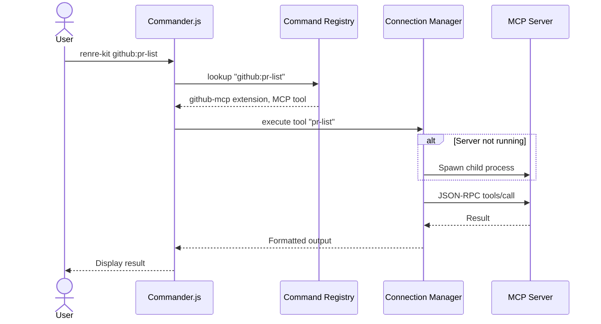
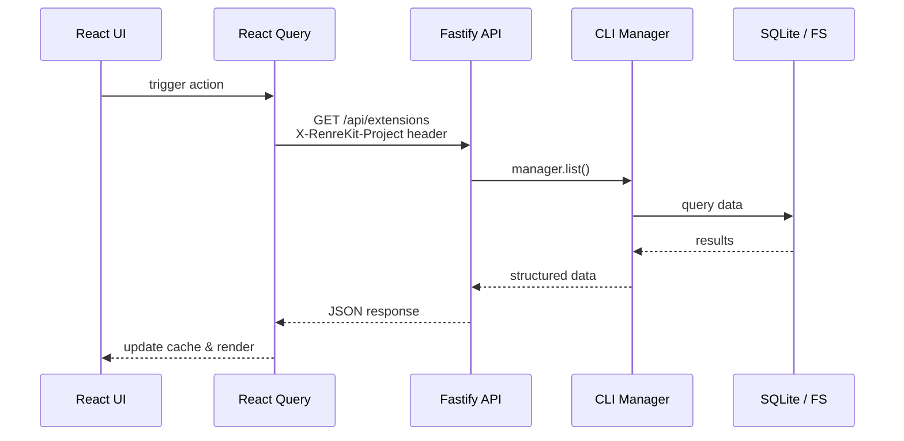
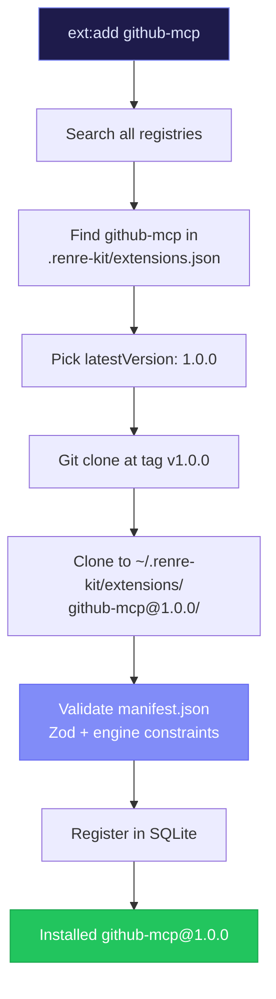
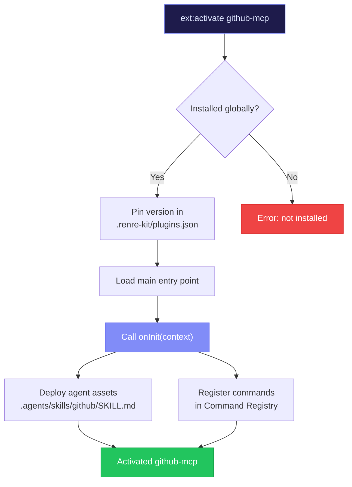
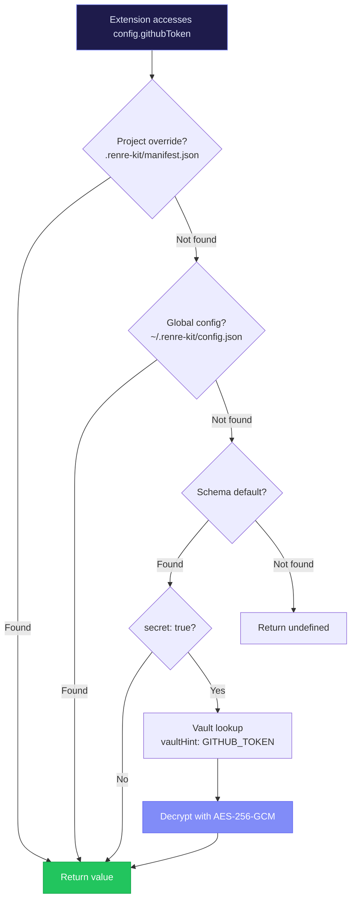
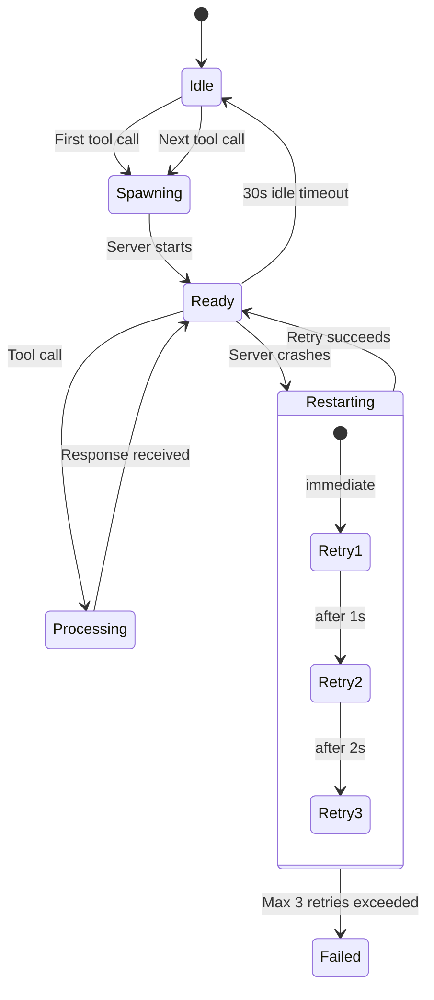
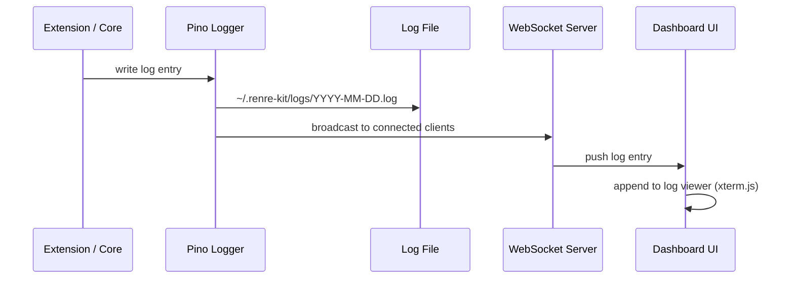

# Data Flow

This page traces how data flows through RenreKit for common operations. Understanding these flows helps you debug issues and build extensions that work with the system.

## CLI Command Flow

When a user runs a command like `renre-kit github:pr-list`:

## Dashboard Request Flow

When the dashboard UI makes an API call:

## Extension Installation Flow

When a user runs `renre-kit ext:add github-mcp`:

## Extension Activation Flow

When a user runs `renre-kit ext:activate github-mcp`:

## Config Resolution Flow

When an extension reads a config value:

## MCP Connection Lifecycle

How the Connection Manager handles MCP servers:

## WebSocket Log Streaming

How live logs reach the dashboard:

