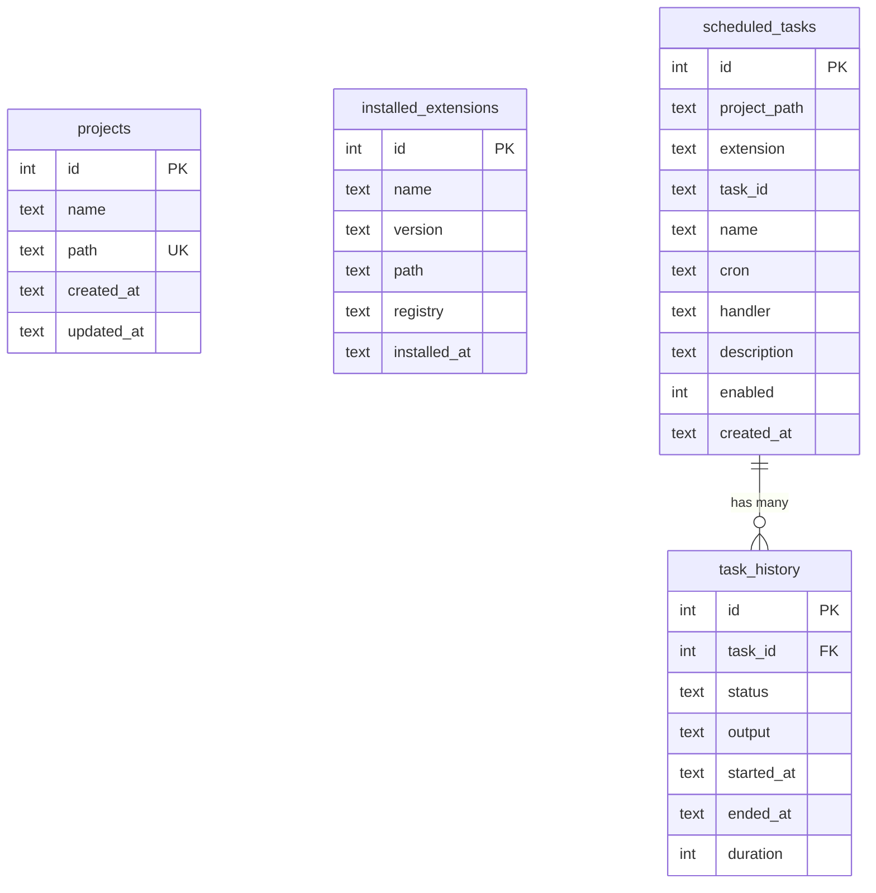

# Database Design

RenreKit uses **SQLite** (via better-sqlite3) as its storage backend. It's a single file, requires no server, and provides a synchronous API that works great for CLI tools.

## Why SQLite?

- **Zero infrastructure** — No database server to install or manage
- **Synchronous API** — Natural fit for CLI commands that run and exit
- **Portable** — The database is a single file at `~/.renre-kit/db.sqlite`
- **Reliable** — ACID transactions, crash-safe

## Schema

The database has four tables:

### projects

Tracks all known RenreKit projects.

```sql
CREATE TABLE projects (
  id          INTEGER PRIMARY KEY AUTOINCREMENT,
  name        TEXT    NOT NULL,
  path        TEXT    NOT NULL UNIQUE,
  created_at  TEXT    NOT NULL DEFAULT (datetime('now')),
  updated_at  TEXT    NOT NULL DEFAULT (datetime('now'))
);
```

### installed_extensions

Tracks globally installed extensions.

```sql
CREATE TABLE installed_extensions (
  id          INTEGER PRIMARY KEY AUTOINCREMENT,
  name        TEXT    NOT NULL,
  version     TEXT    NOT NULL,
  path        TEXT    NOT NULL,
  registry    TEXT,
  installed_at TEXT   NOT NULL DEFAULT (datetime('now')),
  UNIQUE(name, version)
);
```

### scheduled_tasks

Cron-based tasks registered by extensions.

```sql
CREATE TABLE scheduled_tasks (
  id            INTEGER PRIMARY KEY AUTOINCREMENT,
  project_path  TEXT    NOT NULL,
  extension     TEXT    NOT NULL,
  task_id       TEXT    NOT NULL,
  name          TEXT    NOT NULL,
  cron          TEXT    NOT NULL,
  handler       TEXT    NOT NULL,
  description   TEXT,
  enabled       INTEGER NOT NULL DEFAULT 1,
  created_at    TEXT    NOT NULL DEFAULT (datetime('now')),
  UNIQUE(project_path, extension, task_id)
);
```

### task_history

Execution history for scheduled tasks.

```sql
CREATE TABLE task_history (
  id         INTEGER PRIMARY KEY AUTOINCREMENT,
  task_id    INTEGER NOT NULL REFERENCES scheduled_tasks(id),
  status     TEXT    NOT NULL,
  output     TEXT,
  started_at TEXT    NOT NULL,
  ended_at   TEXT,
  duration   INTEGER
);
```

## Entity Relationships



## Migrations

Database migrations live in `packages/cli/migrations/`:

```
migrations/
└── 001-initial-schema.sql
```

Migrations run automatically when the CLI starts. The system uses a simple version tracking approach — each migration file has a numeric prefix, and the database tracks which migrations have been applied.

### Adding Migrations

To add a new migration:

1. Create a new file: `002-my-change.sql`
2. Write your SQL (both `UP` and `DOWN` sections if applicable)
3. The CLI applies it automatically on next run

::: tip Resilient migrations
Migrations are designed to be idempotent and resilient. They use `IF NOT EXISTS` and `IF EXISTS` clauses where appropriate, so re-running them is safe.
:::

## Access Patterns

The database uses better-sqlite3's **synchronous API**. This is intentional — CLI commands should be fast and blocking:

```typescript
// Example: get all projects
const projects = db.prepare('SELECT * FROM projects').all();

// Example: register a project
db.prepare('INSERT INTO projects (name, path) VALUES (?, ?)').run(name, path);
```

No async/await, no connection pools, no ORM overhead.
