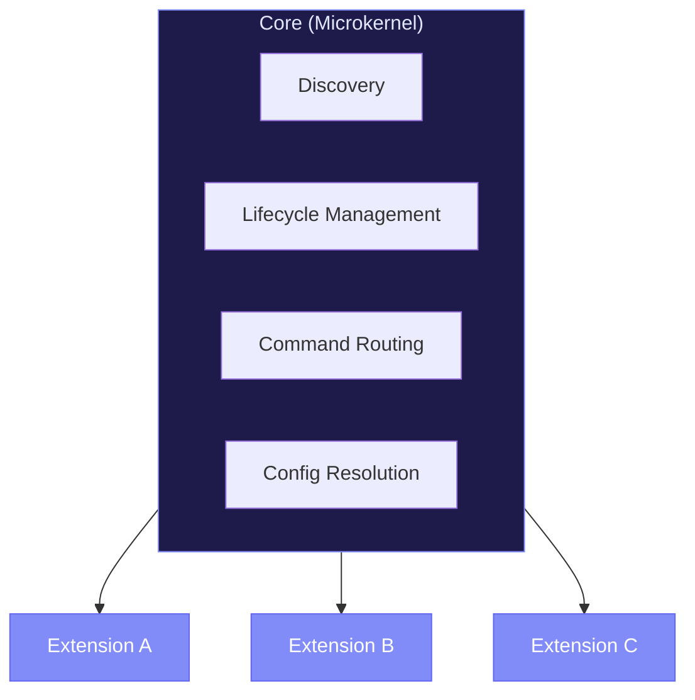

# Microkernel Pattern

RenreKit uses a **Microkernel (Plugin Architecture)** — one of the oldest and most battle-tested software architecture patterns. This page explains why we chose it and how it shapes the system.

## What Is a Microkernel?

A microkernel architecture has two parts:

1. **The core** — minimal, stable, rarely changes
2. **Extensions (plugins)** — where all the real features live

The core provides just enough infrastructure for extensions to work: discovery, loading, lifecycle management, and inter-component communication. Everything else is an extension.

## Why Microkernel?

### Stability

The core changes rarely. When it does, extensions aren't affected (as long as they respect engine version constraints). This means fewer breaking changes and a more predictable upgrade path.

### Flexibility

Different projects need different tools. With a microkernel, each project activates only the extensions it needs. No bloat, no unused code running.

### Independent Development

Extensions can be developed, tested, and versioned independently. Teams can build internal extensions without touching the core.

### Familiar Pattern

If you've used VS Code, Vim, or Webpack — you already understand this model. RenreKit's extension system will feel intuitive.

## How RenreKit Implements It

### The Core (`packages/cli/`)

The core provides:

| Component | Responsibility |
|-----------|---------------|
| **Command Registry** | Resolves `namespace:command` lookups to handler functions |
| **Extension Manager** | Install, activate, configure, update, deactivate, remove |
| **Connection Manager** | MCP server lifecycle (start, stop, health) |
| **Project Manager** | Project creation, deletion, registry in SQLite |
| **Config Manager** | Three-layer config resolution with vault decryption |
| **Vault Manager** | AES-256-GCM encryption/decryption |
| **Registry Manager** | Git-based extension registries |
| **Database** | SQLite with migrations |
| **Logger** | Pino-based structured logging |

### Extensions (`extensions/`)

Extensions provide everything users actually interact with:
- CLI commands
- Dashboard UI panels and widgets
- LLM skills and agent assets
- Scheduled tasks
- Configuration schemas

### The Boundary

The contract between core and extensions is the **manifest**. As long as an extension's `manifest.json` is valid and its engine constraints are satisfied, the extension works.

The core doesn't know or care what an extension does internally — it only knows:
1. What commands it registers
2. What UI it contributes
3. What agent assets it deploys
4. What config schema it declares

## Trade-offs

Like any architecture, there are trade-offs:

| Benefit | Trade-off |
|---------|-----------|
| Flexible, composable | More moving parts than a monolith |
| Independent development | Need to maintain the extension contract |
| Stable core | Core features take more design effort |
| Language-agnostic (MCP) | IPC overhead for non-standard extensions |

For RenreKit's use case — a developer tool platform where different users need different toolsets — the microkernel pattern is a natural fit.
