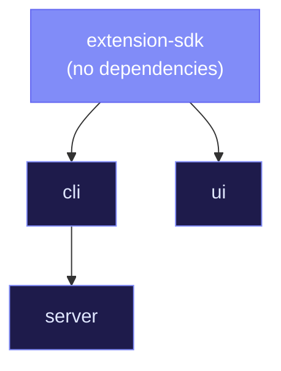

# Monorepo & Packages

RenreKit is organized as a **Turborepo + pnpm workspaces** monorepo. This page explains the package structure, build order, and how packages relate to each other.

## Repository Layout

```
rex/
├── packages/
│   ├── cli/                      # Core CLI — the brain
│   ├── server/                   # Dashboard API (Fastify)
│   ├── ui/                       # Dashboard SPA (React 19)
│   ├── extension-sdk/            # SDK for extension authors
│   └── create-renre-extension/   # Scaffolding tool
├── extensions/                   # Reference extensions
│   ├── hello-world/
│   ├── github-mcp/
│   ├── renre-atlassian/
│   ├── miro-mcp/
│   ├── context7-mcp/
│   ├── figma-mcp/
│   └── chrome-debugger/
├── renre-kit-architecture/       # Architecture docs & ADRs
├── doc/                          # This documentation site
└── turbo.json                    # Turborepo task config
```

## Build Dependency Graph



Turborepo handles this ordering automatically. Run `pnpm build` and it does the right thing.

## Package Details

### @renre-kit/cli

**The heart of the system.** Everything flows through the CLI package.

| Aspect | Detail |
|--------|--------|
| **Build** | tsup (ESM output) |
| **Entry points** | `index.ts` (CLI binary), `lib.ts` (library for server) |
| **Domain structure** | `core/` → `features/` → `shared/` |
| **Key features** | Extensions, registry, vault, config, database, commands |
| **Dependencies** | Commander.js, better-sqlite3, Zod, simple-git, Pino |

The CLI has **two entry points** — this is important:

- **`index.ts`** — Runs the Commander.js program. This is what users invoke from the terminal.
- **`lib.ts`** — Exports all managers (ProjectManager, ExtensionManager, VaultManager, etc.) as a library. The server package imports from here.

### @renre-kit/server

**A thin REST adapter.** Zero business logic.

| Aspect | Detail |
|--------|--------|
| **Build** | tsup, tsx watch (dev) |
| **Framework** | Fastify |
| **Endpoints** | ~32 REST routes |
| **Imports** | Everything from `@renre-kit/cli/lib` |
| **Auth** | PIN-based for LAN access |

Every route follows the same pattern:

```typescript
// Simplified example
server.get('/api/extensions', async (request) => {
  const projectDir = request.headers['x-renrekit-project'];
  const manager = new ExtensionManager(projectDir);
  return manager.list();
});
```

### @renre-kit/ui

**The React dashboard.**

| Aspect | Detail |
|--------|--------|
| **Build** | Vite |
| **Framework** | React 19 |
| **Styling** | Tailwind CSS + shadcn/ui |
| **Data** | React Query |
| **Dev port** | 4201 (proxies /api to 4200) |
| **Features** | Dashboard, marketplace, vault, scheduler, settings, logs |

### @renre-kit/extension-sdk

**Everything extension authors need.**

| Aspect | Detail |
|--------|--------|
| **Build** | tsup |
| **Export paths** | `.` (API + hooks), `./components` (UI), `./node` (Node utils) |
| **Components** | Full shadcn/ui component set |
| **Hooks** | useCommand, useStorage, useEvents, useScheduler |
| **Node utils** | deployAgentAssets, cleanupAgentAssets, buildPanel |

### create-renre-extension

**Scaffolding tool** for generating new extensions.

```bash
npx create-renre-extension my-extension
npx create-renre-extension my-mcp-tool --type mcp
```

Generates a complete extension skeleton with manifest, entry point, commands, and SKILL.md.

## Domain Folder Structure

All packages follow the same internal organization:

```
src/
├── core/        # Infrastructure: database, event-bus, logger, paths, types
├── features/    # Domain modules: extensions/, registry/, vault/, config/
└── shared/      # Cross-cutting utilities: fs-helpers, platform, interpolation
```

This keeps the codebase navigable — once you know the pattern, you know where to find things in any package.

## TypeScript Configuration

Each package has three tsconfig variants:

| File | Purpose |
|------|---------|
| `tsconfig.json` | Base configuration, used by IDEs |
| `tsconfig.build.json` | Build config (stricter, excludes tests) |
| `tsconfig.lint.json` | Lint config (used by ESLint) |

Key TypeScript settings:
- **ESM throughout** — `.js` extensions in imports
- **`noUncheckedIndexedAccess: true`** — always handle potential `undefined`
- **`import type`** for type-only imports
- **CLI/server**: `NodeNext` module resolution
- **UI/SDK**: `Bundler` module resolution
