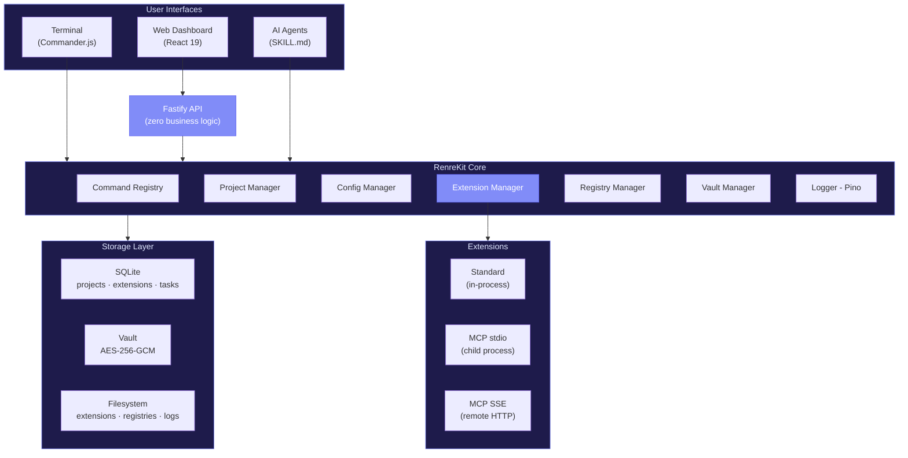

# Architecture Overview

RenreKit follows a **Microkernel (Plugin Architecture)** pattern. A thin core handles discovery, loading, and routing while extensions provide all domain-specific functionality. This page gives you the big picture.

## System Diagram

## Design Principles

### 1. Extension-First

The core is deliberately minimal. It provides infrastructure (database, config, logging, command routing) but no domain features. All user-facing functionality lives in extensions.

### 2. Zero Business Logic in the Server

The Fastify API server is a thin REST adapter over CLI managers. No logic, no transformation, no state management — just routing HTTP requests to the right manager method. This means the CLI is always the authoritative source.

### 3. Global Install, Local Activation

Extensions are installed once globally (`~/.renre-kit/extensions/`) and activated per-project. This avoids duplicating packages while allowing per-project customization.

### 4. Exact Version Pinning

No version ranges in projects. When you activate `my-extension@2.1.3`, that exact version is recorded. Updates are explicit.

### 5. Trusted Code Model

Extensions run with the same permissions as the user. No sandboxing, no permission prompts. This keeps things simple and fast, with the trade-off that you should only install extensions you trust.

## Tech Stack

| Layer | Technology | Why |
|-------|-----------|-----|
| CLI framework | Commander.js | Mature, zero-config argument parsing |
| Database | SQLite (better-sqlite3) | Synchronous API, no server needed, reliable |
| Schema validation | Zod | Runtime validation with TypeScript inference |
| Git operations | simple-git | Git-based registry management |
| Logging | Pino | Fast JSON logging with rotation |
| API server | Fastify | Lightweight, plugin-based HTTP server |
| Frontend | React 19 | Component model, hooks, concurrent features |
| Build (UI) | Vite | Fast HMR, ESM-native bundling |
| Styling | Tailwind CSS | Utility-first, no CSS architecture overhead |
| Components | shadcn/ui (Radix) | Accessible, composable, themeable |
| Data fetching | React Query | Cache management, background refetching |
| Monorepo | Turborepo | Incremental builds, task dependency graph |
| Testing | Vitest + Playwright | Fast unit tests + E2E browser tests |
| Coverage | Istanbul | Threshold enforcement per-package |

## Key Components

### Command Registry

All commands flow through a central registry. Extensions register their commands at load time, and the registry resolves `namespace:command` lookups.

### Connection Manager

Manages MCP server lifecycles — lazy start, idle timeout (30s), exponential backoff restart (max 3 retries). Extensions don't need to worry about process management.

### Config Manager

Handles the three-layer config resolution chain (project → global → schema defaults) with vault-mapped secret decryption.

### Extension Manager

Orchestrates the full extension lifecycle: install, activate, configure, update, deactivate, remove. Also handles manifest validation and engine compatibility checks.

## Want More Detail?

- [Microkernel Pattern](/architecture/microkernel) — Why this architecture and how it works
- [Monorepo & Packages](/architecture/monorepo) — How the codebase is organized
- [Database Design](/architecture/database) — SQLite schema and migrations
- [Data Flow](/architecture/data-flow) — How requests flow through the system
- [ADRs](/architecture/adrs) — All architecture decision records
