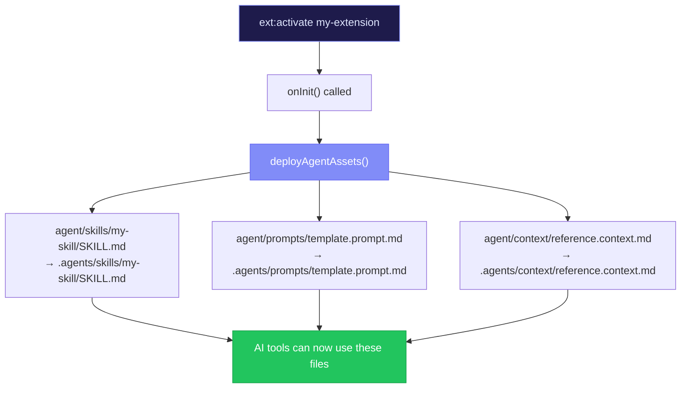
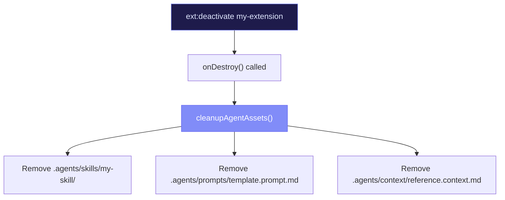

# Agent Assets & Skills

Extensions can ship files that enhance AI agent capabilities. When activated, these files are deployed to the project's `.agents/` directory where AI tools can discover and use them.

## Asset Types

| Type | Extension Path | Deployed To | Purpose |
|------|---------------|-------------|---------|
| **Skills** | `agent/skills/{name}/SKILL.md` | `.agents/skills/{name}/SKILL.md` | How-to instructions for AI |
| **Prompts** | `agent/prompts/*.prompt.md` | `.agents/prompts/` | Reusable prompt templates |
| **Context** | `agent/context/*.context.md` | `.agents/context/` | Background reference docs |
| **Hooks** | `agent/hooks/*.hook.md` | `.agents/hooks/` | Pre/post action hooks |
| **Agents** | `agent/agents/*.agent.md` | `.agents/agents/` | Full agent configurations |
| **Workflows** | `agent/workflows/*.workflow.md` | `.agents/workflows/` | Multi-step workflows |

## Writing a SKILL.md

Skills are the most important asset type. They follow a structured format:

```markdown
# Skill: My Tool

## Description
Brief description of what this skill enables.

## When to Use
- User asks about X
- User wants to do Y
- User mentions Z

## Available Tools
- `tool_name` — What it does
- `another_tool` — What it does

## Configuration
This skill requires the following config:
- `apiToken` — Authentication token (stored in vault)

## Examples

### Example 1: Doing the thing
User: "Do the thing with parameter X"
→ Use `tool_name` with parameter X

### Example 2: Another scenario
User: "Check the status of Y"
→ Use `another_tool` to query status
```

### Tips for Good Skills

1. **Be specific about triggers** — The "When to Use" section is critical. Tell the AI exactly which user intents should activate this skill.
2. **Include real examples** — Show the AI what a user request looks like and what tool to use in response.
3. **Document the tools** — List every available tool with clear descriptions and parameter explanations.
4. **Mention prerequisites** — If config or vault secrets are needed, say so.

## Writing Prompt Templates

Prompts are reusable text templates for common AI interactions:

```markdown
# Prompt: Ticket Template

## Template

Create a Jira ticket with the following structure:

**Title**: [concise summary of the task]
**Type**: [Bug|Task|Story]
**Priority**: [Critical|High|Medium|Low]
**Description**:
  - Context: [why this work is needed]
  - Acceptance criteria: [what "done" looks like]
  - Technical notes: [implementation hints if any]

## Variables
- `projectKey` — The Jira project key (e.g., "PROJ")
- `assignee` — Who to assign the ticket to
```

## Writing Context Documents

Context docs provide background knowledge that helps the AI make better decisions:

```markdown
# Context: API Reference

## Endpoints

### GET /api/items
Returns a list of items.

Query parameters:
- `page` (number) — Page number, default 1
- `limit` (number) — Items per page, default 20
- `status` (string) — Filter by status: active, archived, all

### POST /api/items
Creates a new item.

Body:
- `name` (string, required) — Item name
- `description` (string) — Optional description
- `tags` (string[]) — Optional tags
```

## Manifest Declaration

Declare all your agent assets in the manifest:

```json
{
  "agent": {
    "skills": [
      { "name": "my-skill", "path": "agent/skills/my-skill/SKILL.md" }
    ],
    "prompts": [
      "agent/prompts/ticket-template.prompt.md"
    ],
    "context": [
      "agent/context/api-reference.context.md"
    ]
  }
}
```

## Deployment Flow



## Cleanup Flow



::: tip Version your skills
As your extension evolves, your SKILL.md files should too. When you add new tools or change behavior, update the skill documentation so AI agents always have accurate instructions.
:::
