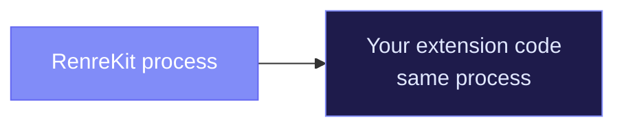
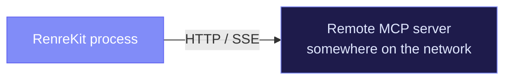
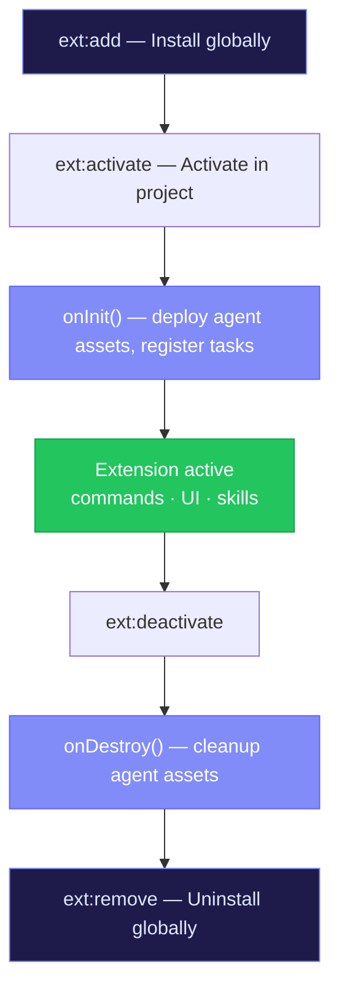

# Extensions Overview

Extensions are the building blocks of RenreKit. Every feature beyond the core discovery/loading/routing mechanism comes from an extension. This section covers everything you need to know about building, configuring, and distributing extensions.

## Extension Types

RenreKit supports three types of extensions, each with different trade-offs:

### Standard Extensions

**Loaded in-process via `require()`**



- Fastest execution — no IPC overhead
- Full access to Node.js APIs
- Share memory with the core
- Best for simple tools and fast commands

### MCP stdio Extensions

**Spawned as a child process, communicates via JSON-RPC over stdin/stdout**


- Fully isolated from the core
- Language-agnostic — write in Python, Go, Rust, whatever
- Automatic lifecycle management (lazy start, idle timeout, restart with backoff)
- Best for tools that need isolation or wrap existing MCP servers

### MCP SSE Extensions

**Connects to a remote HTTP server via Server-Sent Events**



- The server runs independently — always on, shared across instances
- Good for team-wide tools or heavy services
- Requires infrastructure to host the server

## Choosing a Type

| Question | Standard | MCP stdio | MCP SSE |
|----------|----------|-----------|---------|
| Need speed? | Best | Good | Depends on network |
| Need isolation? | No | Yes | Yes |
| Language-agnostic? | Node.js only | Any language | Any language |
| Wrapping an existing MCP server? | No | Perfect fit | If it supports SSE |
| Shared service? | No | No | Yes |

## What Extensions Can Do

Each extension can contribute to one or more of these areas:

### CLI Commands

Register commands that users invoke from the terminal:

```bash
renre-kit my-ext:do-thing --flag value
```

### Dashboard UI

Contribute **panels** (full pages) and **widgets** (grid items on the dashboard):

- Panels: React components loaded dynamically, shown as sidebar items
- Widgets: Small components on the dashboard grid, with configurable sizes

### LLM Skills

Ship `SKILL.md` files that teach AI agents how to use the extension's capabilities.

### Configuration

Define a schema of user-configurable fields, with support for secrets (vault-mapped).

### Scheduled Tasks

Register cron-based tasks that the scheduler runs when the dashboard is active.

## Extension Lifecycle



## Ready to Build?

- [Building a Standard Extension](/extensions/building-standard) — step-by-step guide
- [Building an MCP Extension](/extensions/building-mcp) — for MCP server wrappers
- [Manifest Reference](/extensions/manifest-reference) — every field explained
