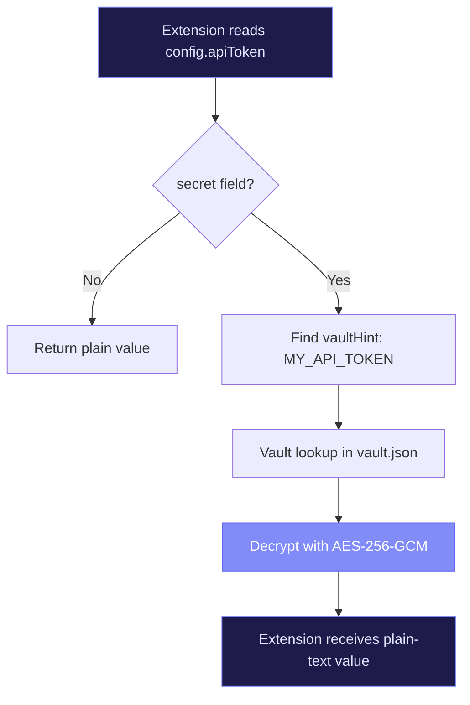

# Configuration

RenreKit has a layered configuration system. Settings can come from the extension's schema defaults, your global config, or per-project overrides. This page explains how all three layers work together.

## The Config Resolution Chain

When RenreKit resolves a config value, it checks three places in order:

```
Project override (.renre-kit/manifest.json)
  → Global config (~/.renre-kit/config.json)
    → Extension schema defaults
```

The first match wins. This means you can set a global default and override it per-project where needed.

## Extension Config Schema

Every extension can define configurable fields in its manifest. Here's what that looks like:

```json
{
  "name": "my-extension",
  "config": {
    "schema": {
      "apiUrl": {
        "type": "string",
        "description": "Base URL for the API",
        "default": "https://api.example.com"
      },
      "maxRetries": {
        "type": "number",
        "description": "Maximum retry attempts",
        "default": 3
      },
      "debugMode": {
        "type": "boolean",
        "description": "Enable verbose logging",
        "default": false
      },
      "apiToken": {
        "type": "string",
        "description": "API authentication token",
        "secret": true,
        "vaultHint": "MY_API_TOKEN"
      }
    }
  }
}
```

### Field Types

| Type | Description | Example |
|------|-------------|---------|
| `string` | Text values | URLs, names, paths |
| `number` | Numeric values | Timeouts, limits, counts |
| `boolean` | True/false flags | Feature toggles, debug modes |

### Secret Fields

When `secret: true`, the value is:
- **Masked** in the UI and CLI output
- **Stored** in the encrypted vault (not in plain text config files)
- **Decrypted** transparently when the extension accesses it

The `vaultHint` field tells RenreKit which vault key to look for. If you've already stored `MY_API_TOKEN` in the vault, the extension picks it up automatically.

## Configuring Extensions via CLI

```bash
# Interactive configuration
renre-kit ext:config my-extension

# Set a specific field
renre-kit ext:config my-extension --set apiUrl=https://custom.api.com
renre-kit ext:config my-extension --set maxRetries=5
renre-kit ext:config my-extension --set debugMode=true
```

## Configuring via the Dashboard

The web dashboard provides a visual form for each extension's config:

1. Go to **Settings → Extensions**
2. Click on the extension you want to configure
3. Fill in the form fields
4. Hit **Save**

Secret fields show a password input, and the value goes straight to the vault.

## Global Settings

Global settings live in `~/.renre-kit/config.json` and affect all projects:

```json
{
  "extensions": {
    "hello-world": {
      "companyName": "Acme Corp"
    },
    "github-mcp": {
      "githubHost": "github.enterprise.com"
    }
  }
}
```

## Per-Project Overrides

To override a setting for just one project, add it to the project's `.renre-kit/manifest.json`:

```json
{
  "name": "my-project",
  "extensions": {
    "hello-world": {
      "companyName": "Project-Specific Corp"
    }
  }
}
```

## Vault-Mapped Config

The real magic happens when config fields reference the vault. When an extension's config has `secret: true` with a `vaultHint`:

1. User runs `renre-kit vault:set MY_API_TOKEN`
2. The token is encrypted and stored in `vault.json`
3. When the extension accesses `config.apiToken`, RenreKit checks the vault hint
4. The encrypted value is decrypted and returned transparently



No plain-text secrets in config files, ever.

::: warning
Never commit `~/.renre-kit/vault.json` or `~/.renre-kit/config.json` to version control. The `.renre-kit/` directory in your project is safe to commit (it doesn't contain secrets).
:::
