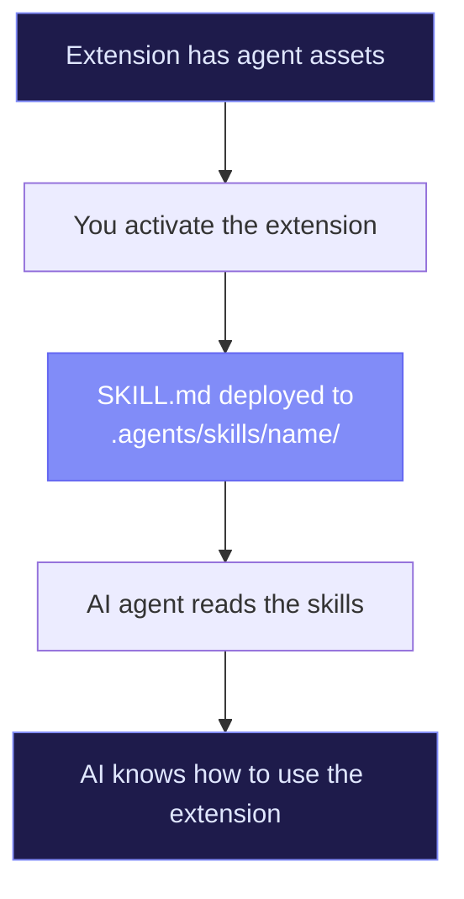

# LLM Skills

One of RenreKit's most unique features is its LLM skill system. Extensions can ship **SKILL.md** files — structured documents that teach AI agents what the extension can do and how to use it.

## The Concept

When you activate an extension that includes skills, those skills get deployed to your project's `.agents/skills/` directory. AI tools that read from this directory (like Claude Code, GitHub Copilot, or custom agents) can then understand and use the extension's capabilities.



## What's in a SKILL.md?

A SKILL.md file follows a structured format that tells the AI:

1. **What** the skill does
2. **When** to use it
3. **How** to use it (with examples)
4. **What tools** are available

Here's an example:

```markdown
# Skill: Jira Task Management

## Description
Manage Jira issues, search boards, and track sprint progress.

## When to Use
- User asks about Jira tickets or issues
- User wants to create, update, or search for tasks
- User mentions sprints, boards, or backlogs

## Available Tools
- `jira_search` — Search for issues using JQL
- `jira_create_issue` — Create a new Jira issue
- `jira_update_issue` — Update an existing issue
- `jira_get_issue` — Get details of a specific issue
- `jira_list_transitions` — List available status transitions

## Examples

### Search for open bugs
User: "Find all open bugs assigned to me"
→ Use `jira_search` with JQL: `assignee = currentUser() AND type = Bug AND status != Done`

### Create a new task
User: "Create a ticket for the login page redesign"
→ Use `jira_create_issue` with type "Task" and the relevant project key
```

## Two-Layer Context System

RenreKit uses a two-layer approach for LLM context:

### Layer 1: Skills (`.agents/skills/`)
Structured how-to documents. These tell the AI *what it can do* and *how to do it*.

### Layer 2: Context (`.agents/context/`)
Reference documents that provide background knowledge. Think architecture docs, API references, or domain-specific terminology.

Extensions can ship both:

```json
{
  "agent": {
    "skills": [
      { "name": "jira", "path": "agent/skills/jira/SKILL.md" }
    ],
    "context": [
      "agent/context/jira-api-reference.context.md"
    ],
    "prompts": [
      "agent/prompts/ticket-template.prompt.md"
    ]
  }
}
```

## Agent Asset Types

| Type | Directory | Purpose |
|------|-----------|---------|
| **Skills** | `.agents/skills/` | Structured how-to instructions |
| **Prompts** | `.agents/prompts/` | Reusable prompt templates |
| **Context** | `.agents/context/` | Background reference documents |
| **Agents** | `.agents/agents/` | Full agent configurations |
| **Workflows** | `.agents/workflows/` | Multi-step workflow definitions |

## Aggregating Skills

To see all active LLM skills across your project:

```bash
renre-kit capabilities
```

This aggregates skills from all activated extensions and shows you what your AI agents can do.

## Deployment & Cleanup

Agent assets are deployed when you activate an extension and cleaned up when you deactivate it. This is handled by the extension's lifecycle hooks:

```typescript
export function onInit(context: HookContext): void {
  // Deploy SKILL.md files to .agents/skills/
  context.sdk.deployAgentAssets();
}

export function onDestroy(context: HookContext): void {
  // Remove deployed files
  context.sdk.cleanupAgentAssets();
}
```

::: tip Works with any AI tool
SKILL.md is a plain Markdown convention — it works with any AI tool that reads from the filesystem. You're not locked into a specific AI provider.
:::
