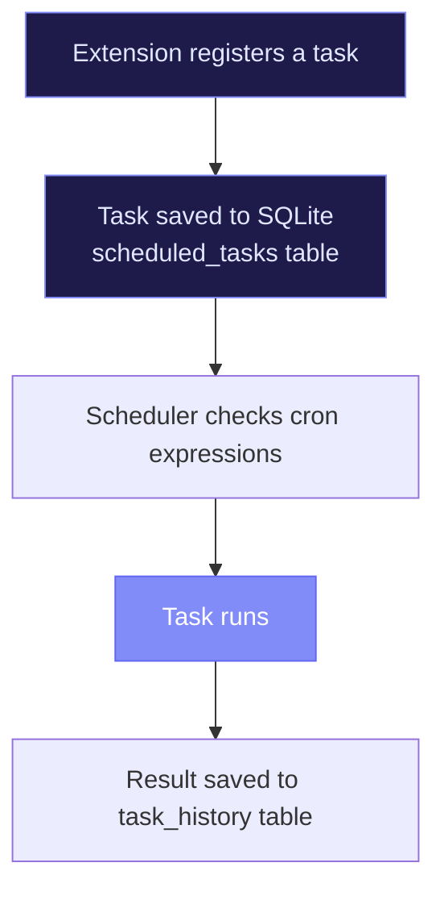

# Scheduler

Extensions can register cron-based tasks that run on a schedule. The scheduler runs inside the dashboard server, persists tasks in SQLite, and tracks execution history.

## How It Works

Extensions register tasks dynamically via the SDK. When the dashboard server is running, the scheduler picks them up and executes them according to their cron expressions.



## CLI Commands

```bash
# List all scheduled tasks for the current project
renre-kit scheduler:list

# Manually trigger a specific task
renre-kit scheduler:trigger <task-id>
```

## Registering Tasks from Extensions

Extensions use the SDK's `useScheduler` hook to register tasks:

```typescript
import { useScheduler } from '@renre-kit/extension-sdk';

// Inside your extension's React component or hook
const scheduler = useScheduler();

// Register a task
scheduler.register({
  id: 'daily-sync',
  name: 'Daily Data Sync',
  cron: '0 9 * * *',       // Every day at 9 AM
  handler: 'dist/tasks/sync.js',
  description: 'Syncs data from the external API',
});
```

### Cron Expression Reference

| Expression | Schedule |
|-----------|----------|
| `* * * * *` | Every minute |
| `0 * * * *` | Every hour |
| `0 9 * * *` | Daily at 9 AM |
| `0 9 * * 1` | Every Monday at 9 AM |
| `0 0 1 * *` | First day of every month |
| `*/5 * * * *` | Every 5 minutes |

## Viewing History

In the dashboard, the scheduler page shows:
- All registered tasks with their next run time
- Execution history with timestamps and results
- Success/failure status for each run

You can also trigger any task manually from the dashboard — useful for testing or when you need a one-off run.

## Persistence

Tasks are stored in the `scheduled_tasks` SQLite table. Execution history goes into `task_history`. This means:

- Tasks survive server restarts
- History is available for debugging
- Each project has its own set of scheduled tasks

::: tip Keep the dashboard running
The scheduler only runs when the dashboard server is active. If you need always-on scheduling, consider running `renre-kit ui --no-browser` as a background service.
:::
