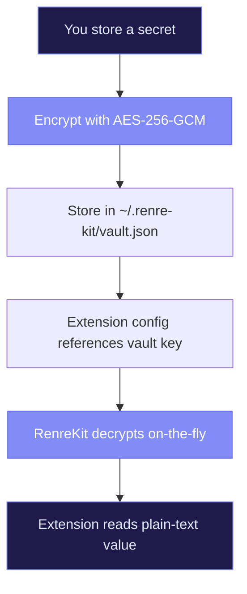

# Encrypted Vault

RenreKit includes a built-in secret manager so you never have to paste API keys into plain-text config files. Secrets are encrypted locally with **AES-256-GCM** and decrypted transparently when extensions need them.

## How It Works

The vault is a single encrypted file at `~/.renre-kit/vault.json`. Each secret is individually encrypted with a key derived from a randomly-generated vault key.



## Storing Secrets

```bash
# Interactive — prompts for the value (hidden input)
renre-kit vault:set GITHUB_TOKEN

# With a value directly
renre-kit vault:set GITHUB_TOKEN ghp_abc123...
```

## Listing Secrets

```bash
renre-kit vault:list
```

This shows key names only — never the actual values:

```
Vault keys:
  GITHUB_TOKEN
  JIRA_API_TOKEN
  MIRO_ACCESS_TOKEN
```

## Removing Secrets

```bash
renre-kit vault:remove GITHUB_TOKEN
```

## Using Vault Secrets in Extensions

Extensions reference vault secrets through their config schema. When a field has `secret: true` and a `vaultHint`, RenreKit does the lookup automatically:

```json
{
  "config": {
    "schema": {
      "githubToken": {
        "type": "string",
        "description": "GitHub personal access token",
        "secret": true,
        "vaultHint": "GITHUB_TOKEN"
      }
    }
  }
}
```

When the extension reads `config.githubToken`, it gets the decrypted value. The extension code doesn't need to know anything about encryption — it's all handled by the core.

### In Your Extension Code

```typescript
import { defineCommand } from '@renre-kit/extension-sdk/node';

export default defineCommand({
  handler: async (ctx) => {
    // This is already decrypted — just use it
    const token = ctx.config.githubToken as string;

    // Make API calls with the token
    fetch('https://api.github.com/user', {
      headers: { Authorization: `Bearer ${token}` },
    });
  },
});
```

## Dashboard Vault UI

The web dashboard provides a visual vault manager:

1. Navigate to the **Vault** page
2. Click **Add Secret**
3. Enter the key name and value
4. The value is encrypted and stored immediately

Secret values are always masked in the UI. You can update or delete secrets from the same page.

## Security Details

| Property | Value |
|----------|-------|
| Algorithm | AES-256-GCM |
| Key derivation | Random 32-byte vault key |
| Storage | `~/.renre-kit/vault.json` |
| Scope | Global (shared across all projects) |
| Access | Only the local user |

::: tip When to use the vault
Use the vault for any value you wouldn't want to accidentally commit to git: API tokens, passwords, webhook secrets, etc. RenreKit's config resolution chain handles the rest.
:::

::: warning Back up your vault key
If you lose your vault key, you lose access to all encrypted secrets. The key is stored alongside the vault — consider backing up `~/.renre-kit/` periodically.
:::
