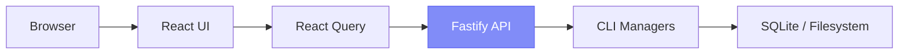

# Web Dashboard

RenreKit ships with a full web dashboard built with React 19, Tailwind CSS, and shadcn/ui. It gives you a visual interface for everything you can do from the CLI — and more, thanks to extension UI panels and widgets.

## Launching the Dashboard

```bash
# Default — opens at http://localhost:4200
renre-kit ui

# Custom port
renre-kit ui --port 8080

# Enable LAN access (PIN-protected)
renre-kit ui --lan

# Don't auto-open the browser
renre-kit ui --no-browser
```

Under the hood, this starts:
- A **Fastify API server** on the specified port (default 4200)
- The **React SPA** served from the same port

## Dashboard Features

### Home & Projects

The home page shows your current project status at a glance. Use the **project switcher** in the sidebar to jump between projects.

### Extension Dashboard

A customizable widget grid where extensions contribute their own widgets. Drag and drop to rearrange, resize widgets, and pick which ones to display from the **widget picker**.

Widgets follow a 12-column grid system:
- Width: 1-12 columns
- Height: 1+ rows (100px per row)
- Each widget declares its default, minimum, and maximum size

### Marketplace

Browse available extensions from your configured registries. From here you can:
- Search and filter extensions
- View extension details and descriptions
- Install or remove extensions with one click
- See which extensions are active in your current project

### Vault Manager

A visual interface for managing encrypted secrets:
- Add new secrets
- View key names (values are always masked)
- Delete secrets you no longer need

### Scheduler

View and manage scheduled tasks registered by extensions:
- See all scheduled tasks and their cron expressions
- View execution history
- Trigger tasks manually
- Check task status

### Settings

A multi-section settings page:
- **General** — Global configuration
- **Extensions** — Per-extension config forms (auto-generated from config schemas)
- **Registries** — Manage git-based extension registries

### Extension Panels

Each extension can contribute full-page **panels** to the dashboard. These are React components bundled with esbuild and loaded dynamically. Navigate to them from the sidebar under the extension's name.

### Live Logs

Real-time log streaming via WebSocket. Watch what's happening across all extensions and the core in real-time — useful for debugging and monitoring.

### Integrated Terminal

The dashboard includes a built-in terminal (powered by xterm.js) so you can run CLI commands without leaving the browser.

## LAN Access

When you pass `--lan`, the dashboard becomes accessible from other devices on your network:

```bash
renre-kit ui --lan
```

This generates a **4-digit PIN** that anyone on your LAN must enter to access the dashboard. The PIN is displayed in the terminal when you start the server.

```
Dashboard running at http://localhost:4200
LAN PIN: 7392
```

::: tip Mobile-friendly
The dashboard is responsive — access it from your phone or tablet on the same network to keep an eye on your project while you're away from your desk.
:::

## Architecture Note

The dashboard server has **zero business logic**. Every endpoint imports a CLI manager (via `@renre-kit/cli/lib`) and calls it directly. This means the CLI is always the single source of truth — the dashboard is just a visual layer on top.



All requests are scoped by the `X-RenreKit-Project` header, so the server knows which project you're working with.
