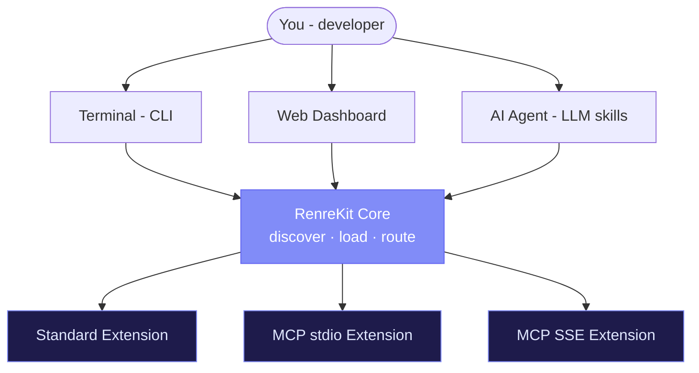

# What Is RenreKit?

RenreKit is a **microkernel CLI** — a tiny core that does very little on its own, but becomes powerful through **extensions**. Think of it like VS Code, but for your terminal and AI workflows.

## The Big Idea

The core handles exactly three things:

1. **Discovering** extensions
2. **Loading** them
3. **Routing** commands to them

That's it. Every feature, every command, every UI panel — it all comes from extensions. This keeps the core tiny and stable while letting the ecosystem grow organically.

## Three Ways to Interact

Each extension can plug into one, two, or all three interaction modes:

| Mode | What it does | Example |
|------|-------------|---------|
| **CLI commands** | Terminal commands you can run from anywhere | `renre-kit github:pr-list` |
| **Dashboard panels** | Visual UI in the web dashboard | A Jira board widget on your dashboard |
| **LLM skills** | SKILL.md files that teach AI agents new capabilities | Claude learns to search Confluence |

This means a single "Atlassian" extension could give you CLI commands for Jira, a dashboard widget showing your tasks, *and* AI skills for searching Confluence — all from one package.

## How It All Fits Together

## Who Is It For?

- **Teams** who want to centralize their dev tools behind one CLI
- **Extension authors** who want to build tools that work across CLI, web, and AI
- **AI-powered workflows** that need structured skill definitions
- **Anyone** who's tired of juggling a dozen different CLI tools

## Key Design Decisions

A few things that make RenreKit opinionated in the right ways:

- **Global install, local activation** — Extensions are installed once globally, then activated per-project. No bloat.
- **Exact version pinning** — Every project locks its extension versions. No "works on my machine" surprises.
- **Git-based registries** — Extension registries are plain git repos. No custom infrastructure needed.
- **Zero business logic in the server** — The dashboard API is a thin REST wrapper over CLI managers. One source of truth.
- **Trusted code model** — Extensions run with the same permissions as the user. Simple, pragmatic, no sandboxing overhead.

## Ready to Jump In?

Head to the [Getting Started](/guide/getting-started) guide and have a running project in under 5 minutes.
