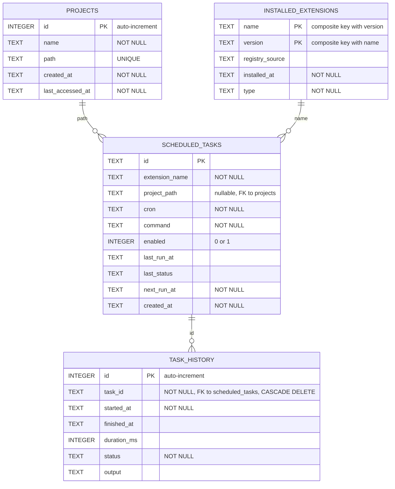

# Database Schema

This document describes the relational database schema for the Rex Kit architecture. The schema consists of four main tables that manage projects, extensions, scheduled tasks, and task execution history.

## Entity-Relationship Diagram

## Table Descriptions

### projects

Stores information about Rex Kit projects. Each project has a unique path and tracks when it was created and last accessed.

### installed_extensions

Manages installed extensions with composite primary key (name, version). Tracks the registry source, installation date, and extension type.

### scheduled_tasks

Stores scheduled tasks that are associated with extensions and optionally with specific projects. Includes cron schedule, command, enabled status, and execution tracking fields.

### task_history

Records the execution history of scheduled tasks. Links to scheduled_tasks with cascade delete semantics, storing execution duration, status, and output logs.

## Relationships

- **projects ↔ scheduled_tasks**: One-to-many relationship. A project can have multiple scheduled tasks, and tasks optionally reference a project via project_path.
- **installed_extensions ↔ scheduled_tasks**: One-to-many relationship. An extension can have multiple scheduled tasks referencing it by name.
- **scheduled_tasks ↔ task_history**: One-to-many relationship with cascade delete. A task can have many history records, and deleting a task removes its history.
