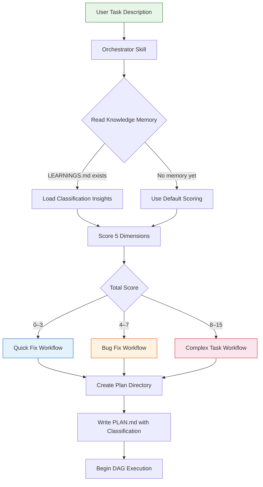
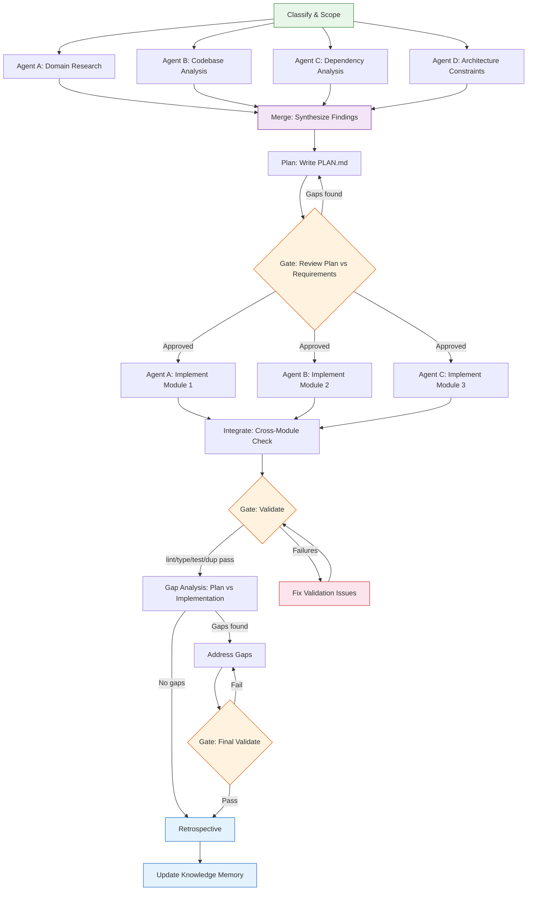
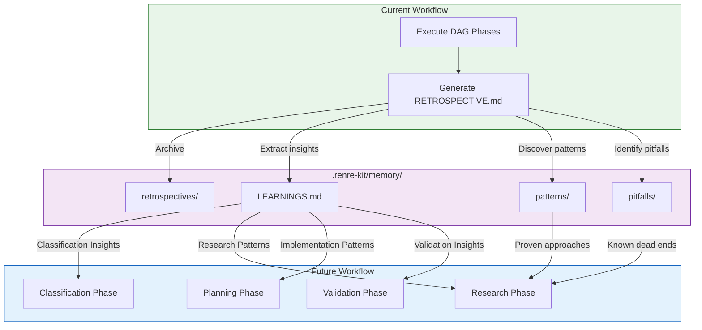
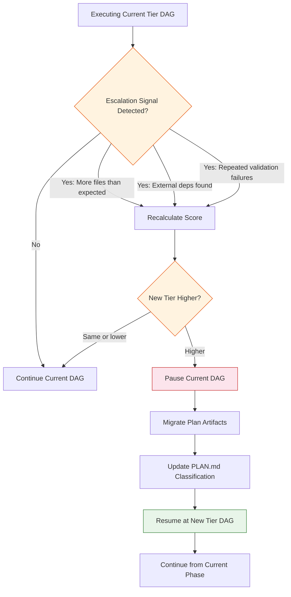
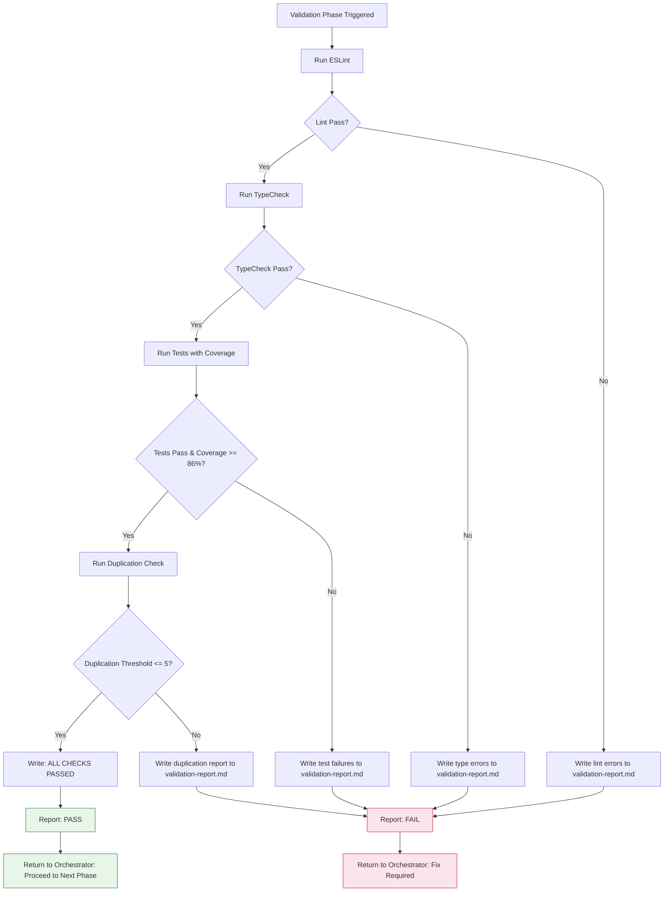

# Developer Workflow — Data Flow Diagrams

Data flow diagrams for the RenRe Developer Workflow extension, covering task classification, DAG orchestration, agent communication, and knowledge memory.

See [ADR-001: DAG-Based Workflow Orchestration](../adr/developer-workflow/ADR-001-dag-based-workflow-orchestration.md)

---

## 1. Task Classification and Routing Flow

How an incoming task is analyzed, scored, and routed to the appropriate workflow tier.

---

## 2. DAG Orchestration Flow — Complex Task

The full DAG for a complex task showing parallel branches, merge points, and gate nodes.

---

## 3. Agent Communication Flow

How agents write to and read from the shared plan directory during a workflow.

```mermaid
flowchart TD
    subgraph Orchestrator
        O1[Create plan directory]
        O2[Write PLAN.md]
        O3[Read all agent outputs]
        O4[Write merged-findings.md]
        O5[Update progress.md]
        O6[Generate RETROSPECTIVE.md]
    end

    subgraph ResearchAgents["Research Agents (Parallel)"]
        RA[Scout → codebase-analysis.md]
        RB[Researcher → domain-research.md]
        RC[Architect → architecture-constraints.md]
    end

    subgraph ImplAgents["Implementation Agents (Parallel)"]
        IA[Implementer A → module-auth.md]
        IB[Implementer B → module-api.md]
    end

    subgraph ReviewAgent["Review Agent"]
        VA[Reviewer → gap-analysis.md]
        VB[Reviewer → validation-report.md]
    end

    subgraph PlanDir[".renre-kit/plan/{name}/"]
        PM[PLAN.md]
        RD[research/]
        IM[implementation/]
        RV[review/]
        RT[RETROSPECTIVE.md]
    end

    O1 --> PM
    O2 --> PM
    RA --> RD
    RB --> RD
    RC --> RD
    O3 --> |reads| RD
    O4 --> RD
    IA --> IM
    IB --> IM
    O5 --> IM
    VA --> RV
    VB --> RV
    O6 --> RT

    style PlanDir fill:#f5f5f5,stroke:#616161
    style Orchestrator fill:#e3f2fd,stroke:#1565c0
    style ResearchAgents fill:#e8f5e9,stroke:#2e7d32
    style ImplAgents fill:#fff3e0,stroke:#e65100
    style ReviewAgent fill:#fce4ec,stroke:#c62828
```

---

## 4. Knowledge Memory Flow

How retrospective insights flow from completed workflows into memory and back into future workflows.

---

## 5. Reclassification Flow

How the orchestrator detects and handles task escalation mid-workflow.

---

## 6. Validation Suite Flow

The full validation pipeline that runs as a gate node in every workflow tier.

