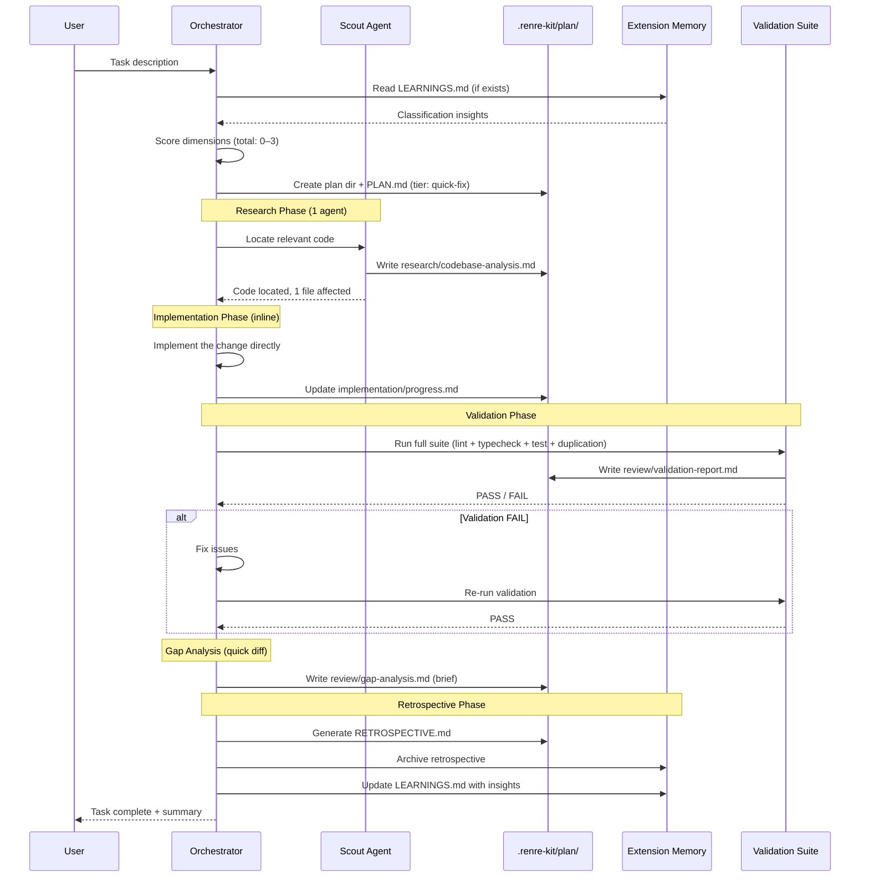
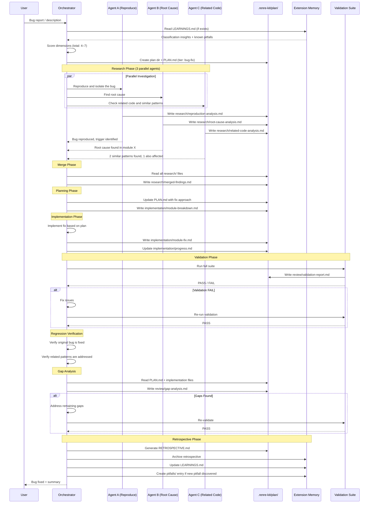
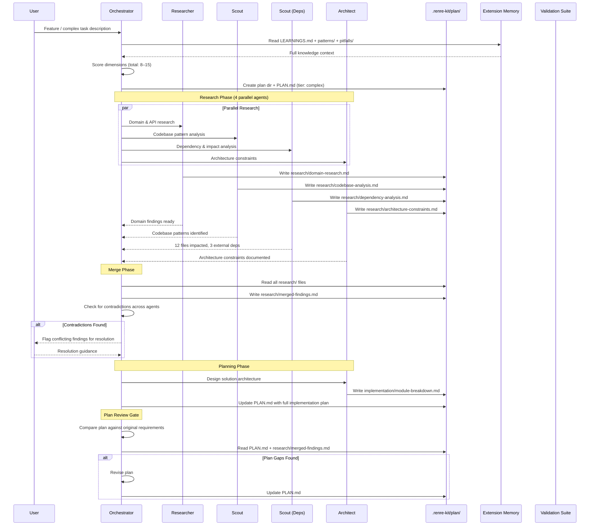
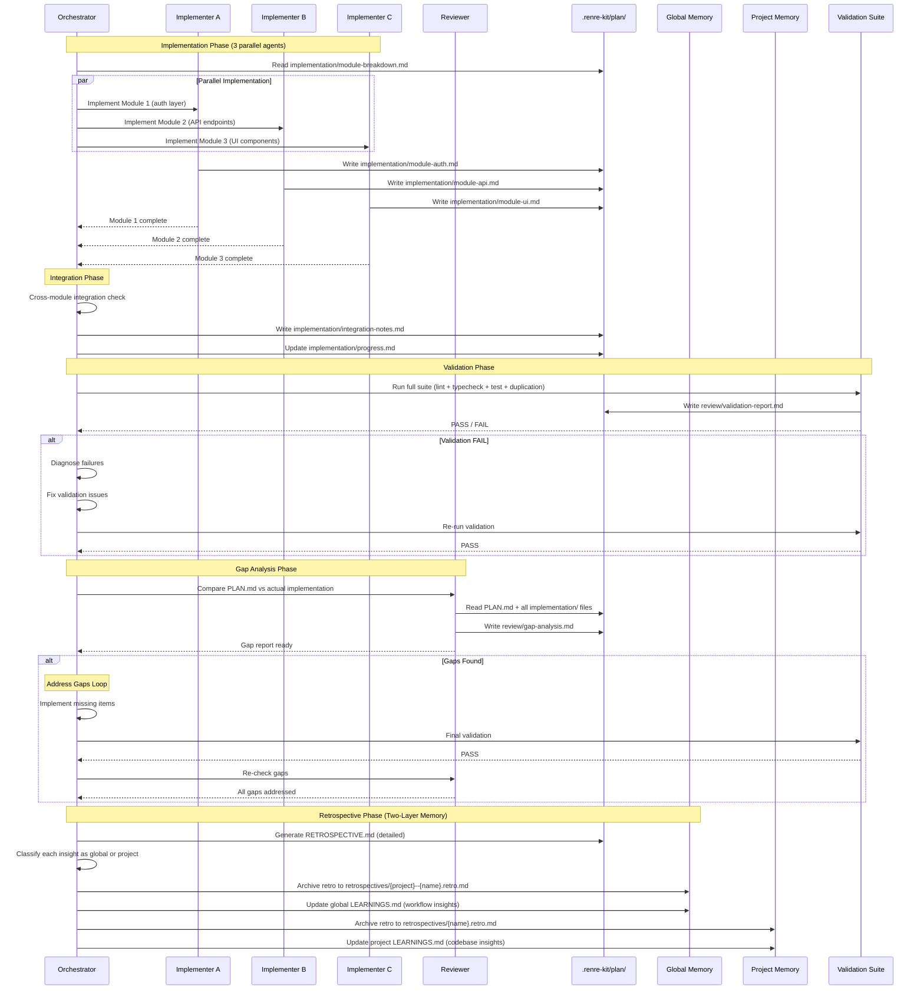
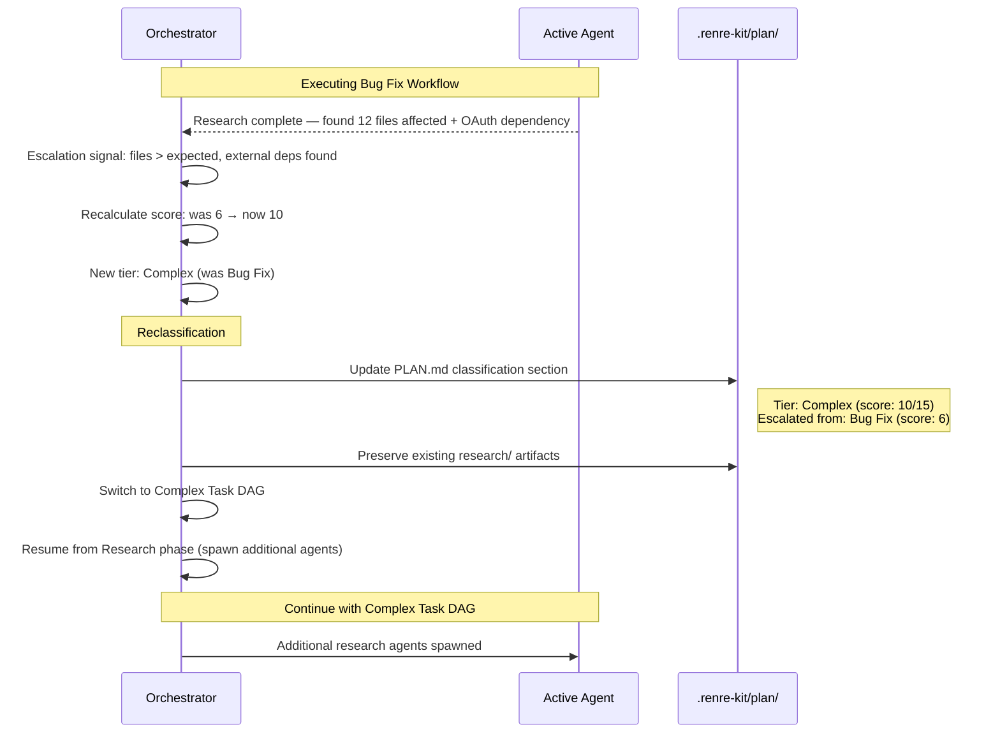
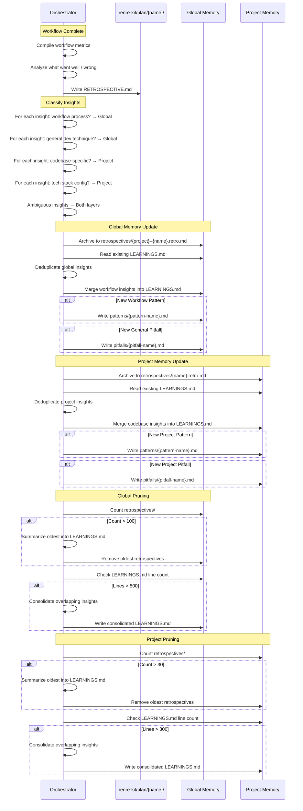

# Developer Workflow — Sequence Diagrams

Sequence diagrams for each workflow tier in the RenRe Developer Workflow extension, showing agent interactions, phase transitions, and file operations.

See [ADR-001: DAG-Based Workflow Orchestration](../adr/developer-workflow/ADR-001-dag-based-workflow-orchestration.md)

---

## 1. Quick Fix Workflow Sequence

Minimal ceremony: single scout agent, direct implementation, validation, and retrospective.

---

## 2. Bug Fix Workflow Sequence

Parallel investigation with 3 agents, merge findings, plan fix, implement, validate, verify regression.

---

## 3. Complex Task Workflow Sequence

Full DAG with parallel research (4 agents), plan review gate, parallel implementation (3 agents), integration, validation, gap analysis loop, and retrospective.

---

## 4. Complex Task — Implementation & Validation Sequence

Continuation of the complex task workflow after plan approval.

---

## 5. Reclassification Sequence

How the orchestrator escalates a task mid-workflow when complexity is discovered.

---

## 6. Two-Layer Knowledge Memory Update Sequence

How retrospective insights are classified, routed to global or project memory, and pruned.

