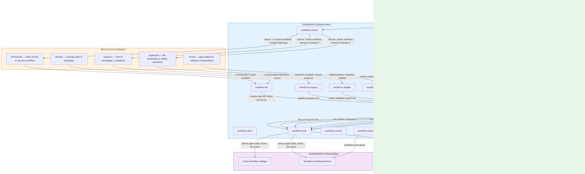
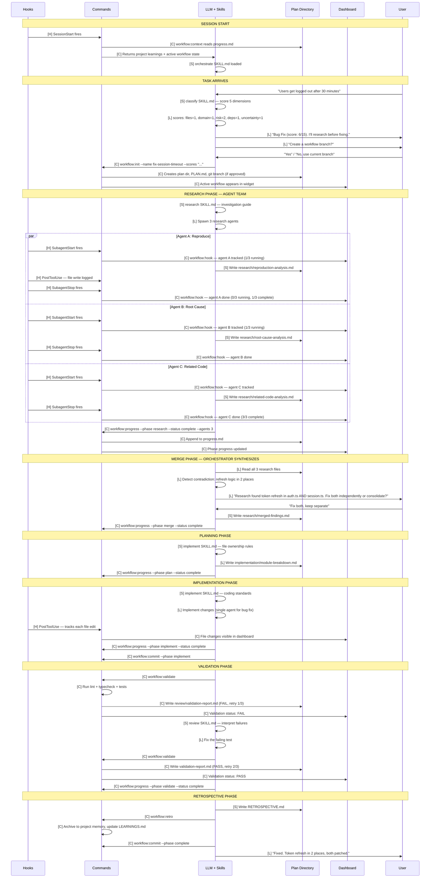
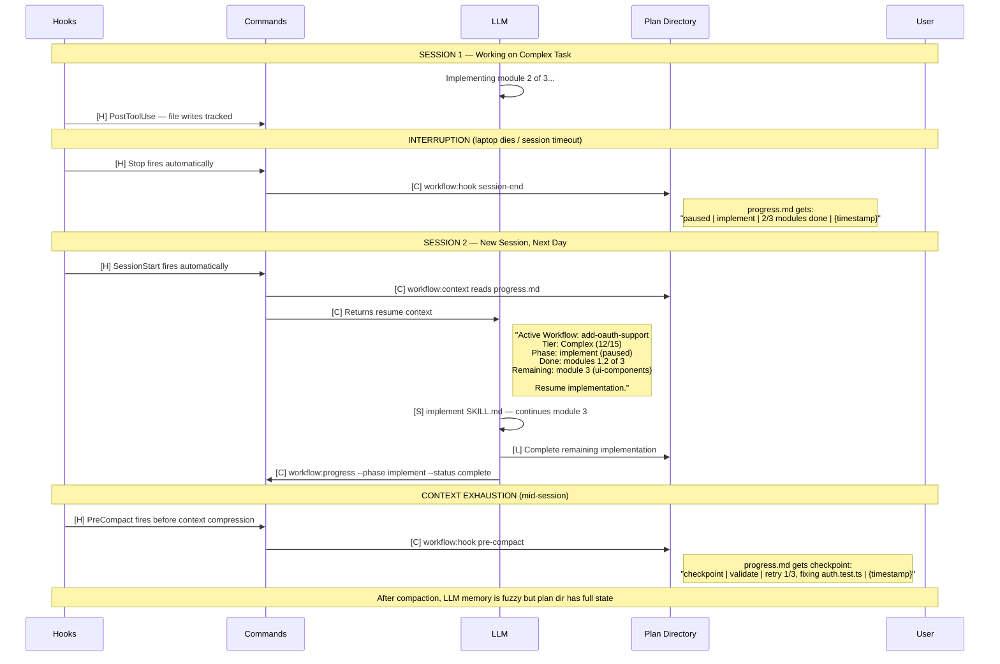
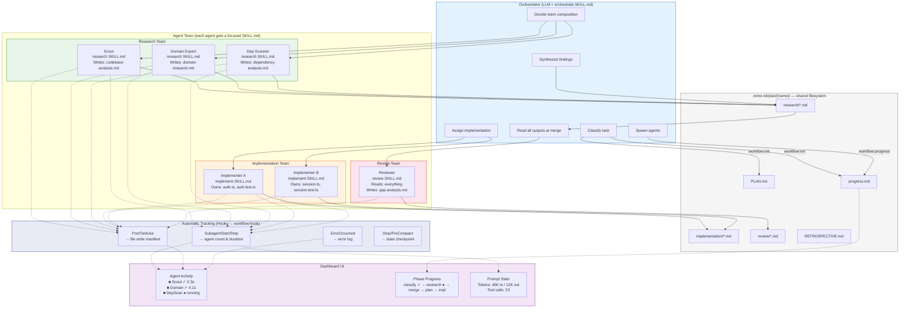
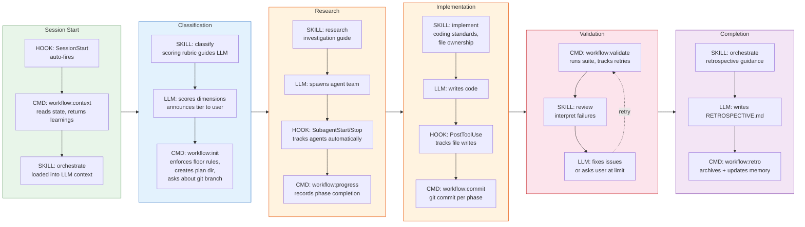
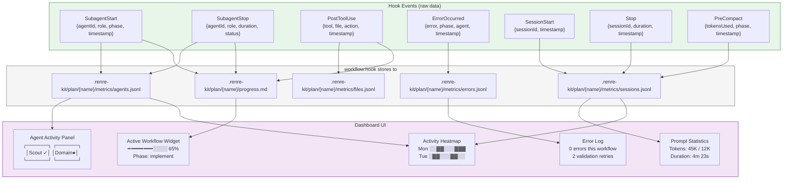
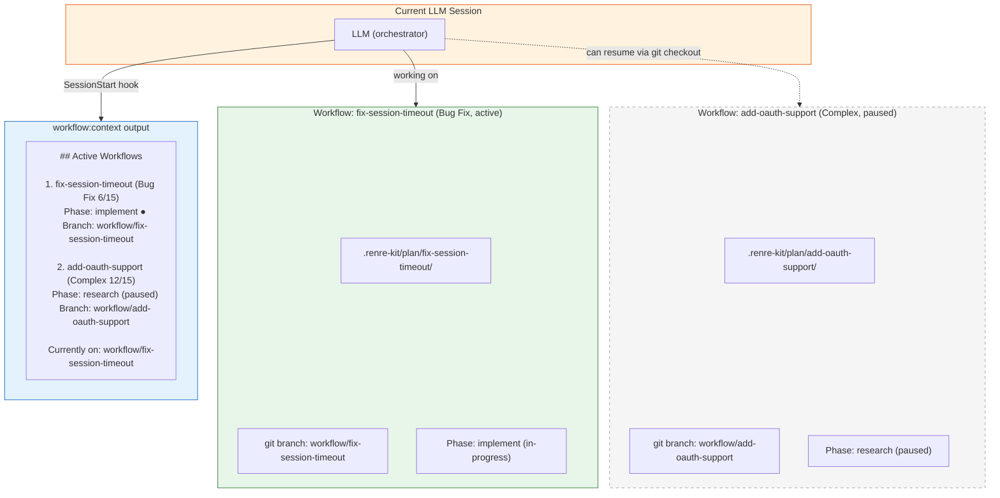

# Developer Workflow — System Interaction Diagrams

How commands, skills, and hooks work together as a feedback loop to coordinate the agent team. These diagrams show the **real system** — what executes, what guides, and what tracks automatically.

See [ADR-005: Prompt-Based Orchestration Constraints](../adr/developer-workflow/ADR-005-prompt-based-orchestration-constraints.md)
See [ADR-006: Extension Manifest and Agent Asset Structure](../adr/developer-workflow/ADR-006-extension-manifest-and-agent-assets.md)
See [ADR-007: Developer Experience and Activation](../adr/developer-workflow/ADR-007-developer-experience-and-activation.md)

---

## 1. The Core Feedback Loop

Commands, skills, and hooks form a continuous cycle. Each tool type feeds the next.

---

## 2. Full Bug Fix Workflow — Tool Type Per Step

Every step annotated with which tool type drives it: **[H]** Hook, **[C]** Command, **[S]** Skill, **[L]** LLM judgment.

---

## 3. Interruption and Resume — Hook Safety Net

Shows how hooks preserve workflow state even when the LLM doesn't cooperate.

---

## 4. Agent Team Communication Pattern

How agents communicate through files, with hooks tracking the process and commands enforcing structure.

---

## 5. Tool Type Responsibility Matrix

What each tool type is responsible for at every workflow phase.

---

## 6. Dashboard Data Flow — What Hooks Feed the UI

---

## 7. Concurrent Workflows — Independent Isolation

