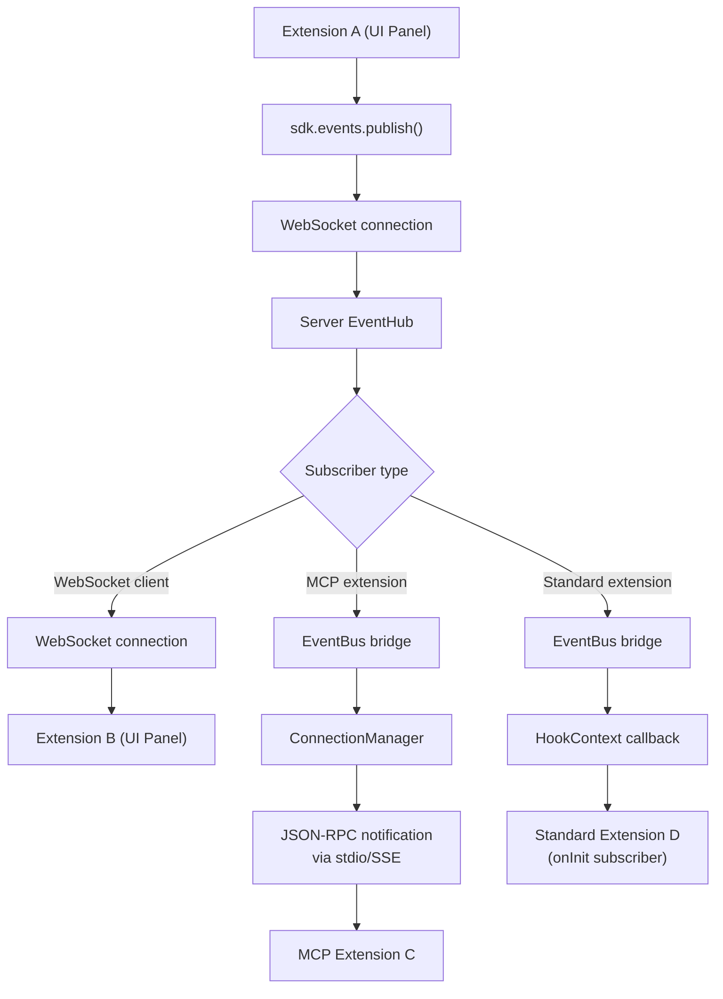
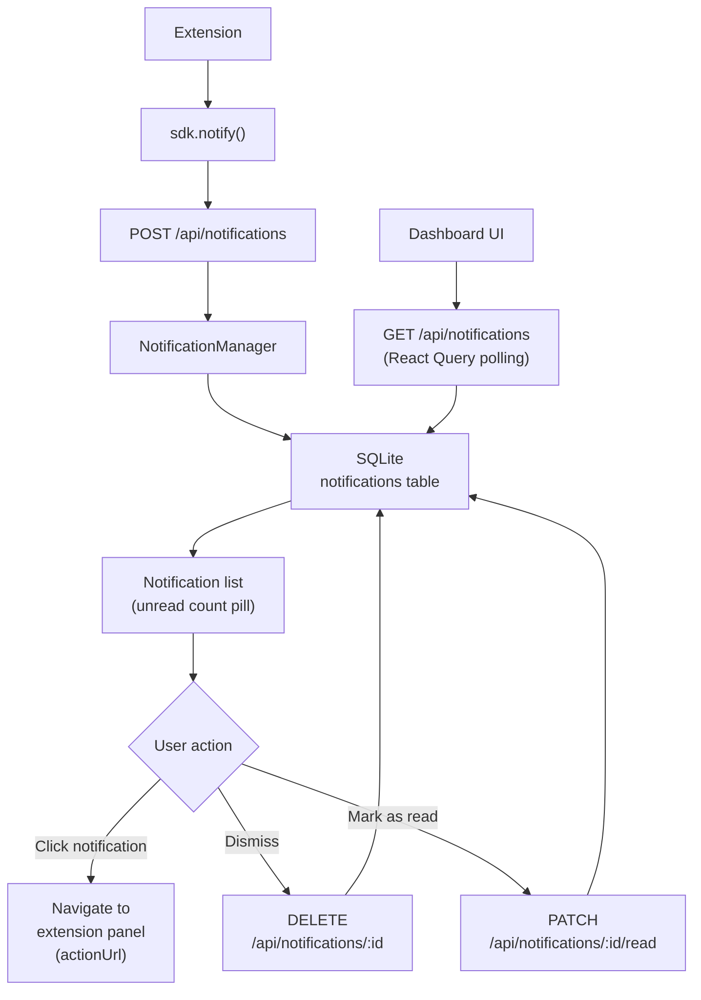
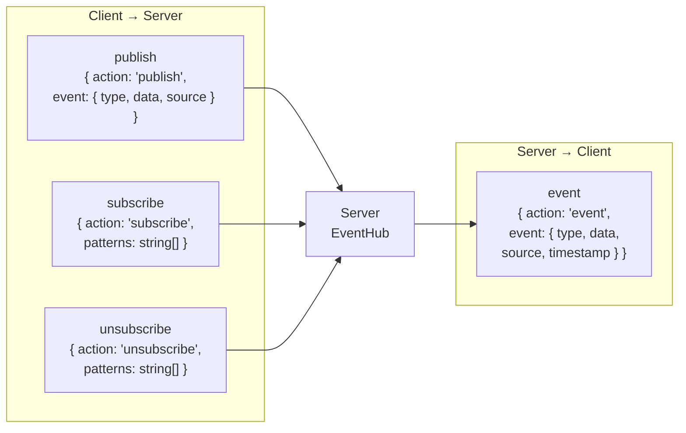
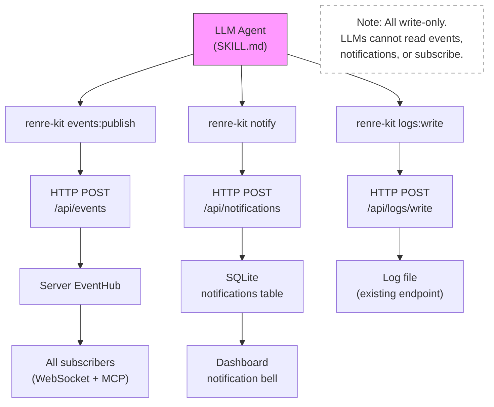

# Data Flow Diagrams - Inter-Extension Events & Notification Center

## 1. Event Publishing & Delivery Flow

This diagram shows how events flow from a publishing extension through the server EventHub to all subscriber types.

## 2. Notification Flow

This diagram shows how notifications are created, stored, and displayed to the user.

## 3. Event Protocol Messages

This diagram shows the four WebSocket message types in the event protocol.

## 4. LLM Agent Access Flow

This diagram shows how LLM agents interact with the event and notification systems through write-only CLI commands.

