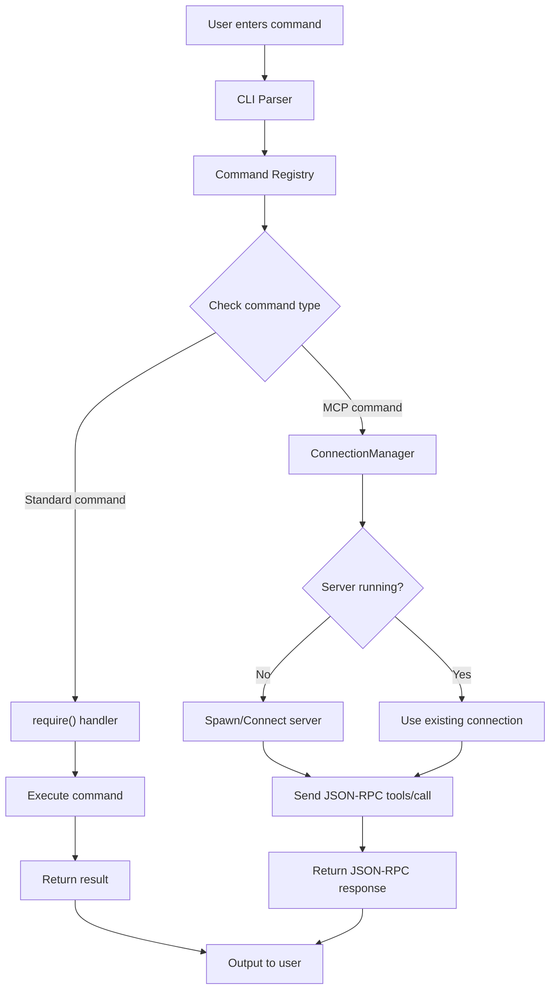
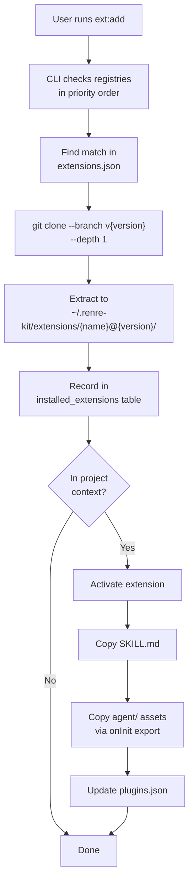
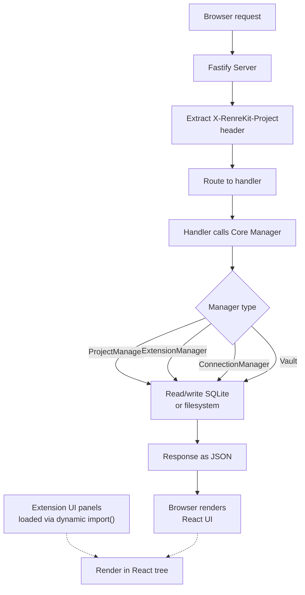
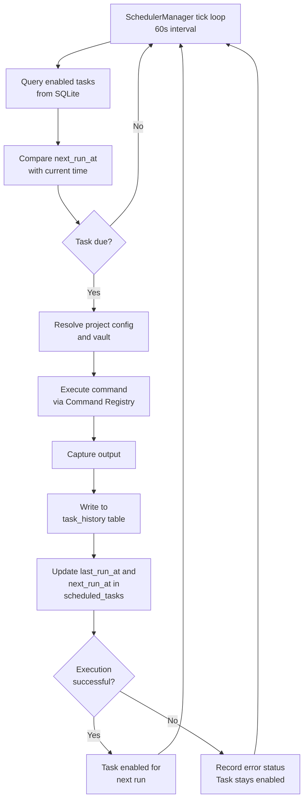
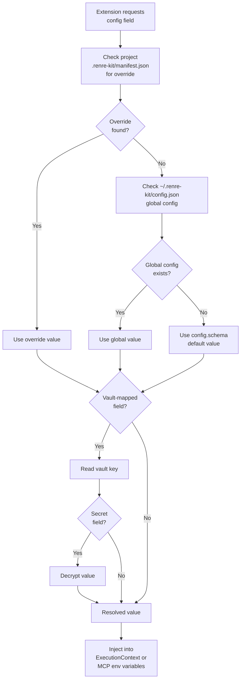

# Data Flow Diagrams - RenreKit Architecture

## 1. Command Execution Flow

This diagram illustrates the complete lifecycle of a user command from CLI input through execution and output.

## 2. Extension Installation Flow

This diagram shows the process of installing and activating extensions through the CLI.

## 3. Dashboard Request Flow

This diagram depicts how browser requests flow through the Fastify server and interact with core managers.

## 4. Scheduler Execution Flow

This diagram shows the scheduler's tick loop and task execution lifecycle.

## 5. Config Resolution Flow

This diagram illustrates how configuration values are resolved with priority ordering and vault integration.

