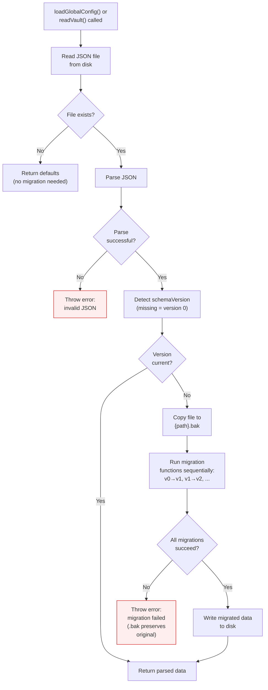
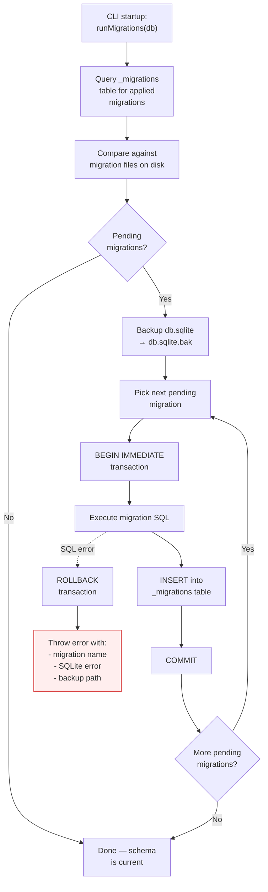
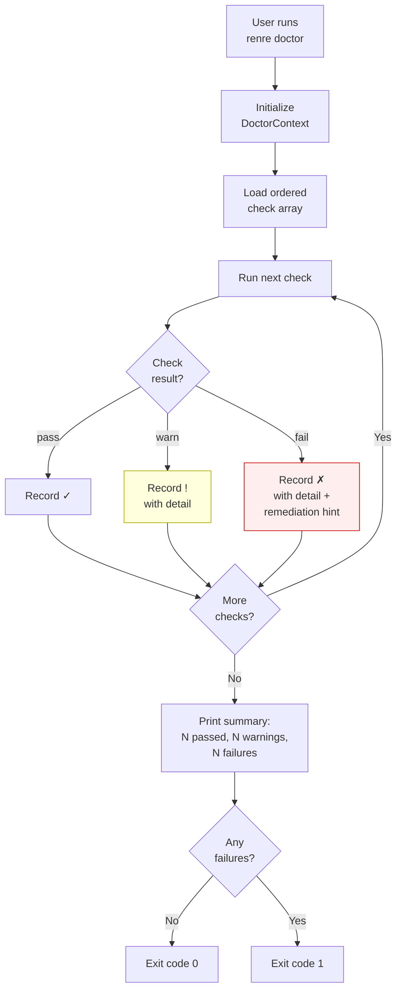

# Data Flow Diagrams - Versioning & Health

## 1. Config/Vault Migration Flow

This diagram illustrates how `config.json` and `vault.json` are migrated when the CLI loads them and detects an outdated `schemaVersion`. See [ADR-004](../adr/core/ADR-004-schema-versioning-migration.md).

## 2. Database Migration Flow

This diagram shows how SQLite migrations run inside transactions with pre-migration backup. See [ADR-006](../adr/core/ADR-006-resilient-database-migrations.md).

## 3. Doctor Command Flow

This diagram depicts the sequential check execution and result aggregation of `renre doctor`. See [ADR-007](../adr/core/ADR-007-doctor-diagnostic-command.md).

