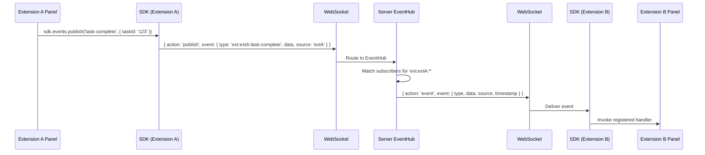
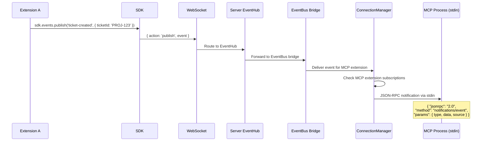
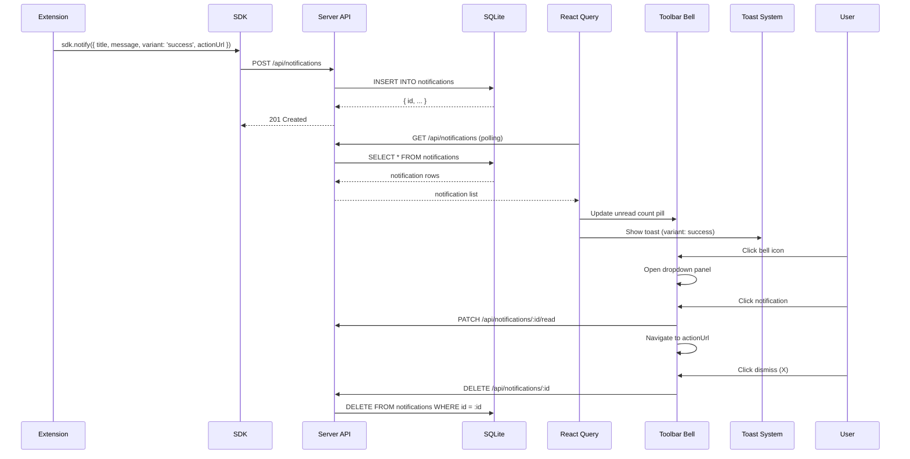
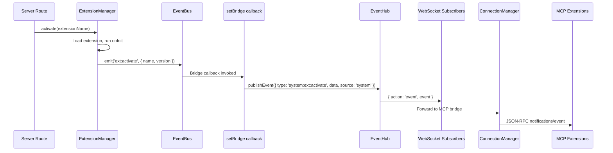
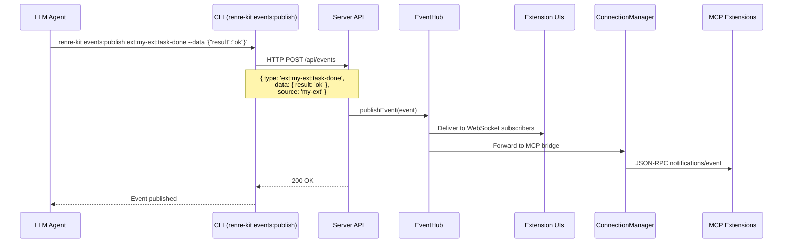
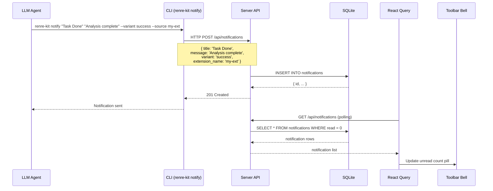

# Inter-Extension Events - Sequence Diagrams

## 1. Extension A Publishes, Extension B Receives (UI-to-UI)

## 2. Extension Publishes, MCP Extension Receives

## 3. Extension Sends Notification to User

## 4. Lifecycle Event Bridging

## 5. LLM Publishes Event via CLI

## 6. LLM Sends Notification via CLI

