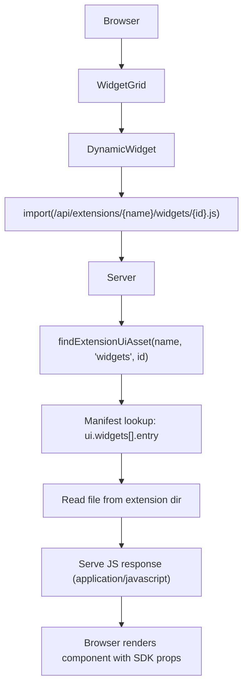
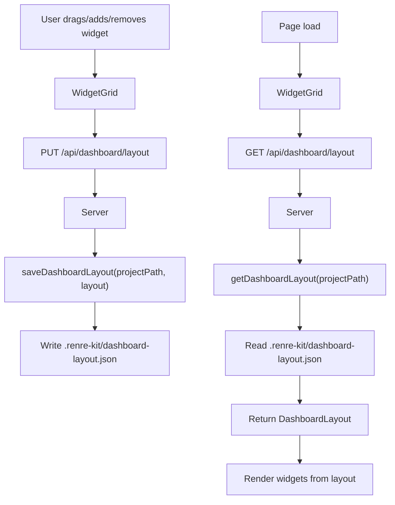
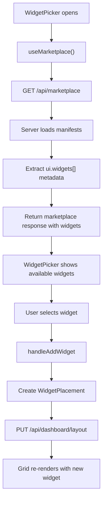

# Widget Dashboard - Data Flow Diagrams

## 1. Widget Loading Flow

```mermaid
flowchart TD
    A["Browser"] --> B["WidgetGrid"]
    B --> C["DynamicWidget"]
    C --> D["import(/api/extensions/{name}/widgets/{id}.js)"]
    D --> E["Server"]
    E --> F["findExtensionUiAsset(name, 'widgets', id)"]
    F --> G["Manifest lookup: ui.widgets[].entry"]
    G --> H["Read file from extension dir"]
    H --> I["Serve JS response (application/javascript)"]
    I --> J["Browser renders component with SDK props"]
```

## 2. Layout Persistence Flow

```mermaid
flowchart TD
    A["User drags/adds/removes widget"] --> B["WidgetGrid"]
    B --> C["PUT /api/dashboard/layout"]
    C --> D["Server"]
    D --> E["saveDashboardLayout(projectPath, layout)"]
    E --> F["Write .renre-kit/dashboard-layout.json"]

    G["Page load"] --> H["WidgetGrid"]
    H --> I["GET /api/dashboard/layout"]
    I --> J["Server"]
    J --> K["getDashboardLayout(projectPath)"]
    K --> L["Read .renre-kit/dashboard-layout.json"]
    L --> M["Return DashboardLayout"]
    M --> N["Render widgets from layout"]
```

## 3. Widget Discovery Flow

```mermaid
flowchart TD
    A["WidgetPicker opens"] --> B["useMarketplace()"]
    B --> C["GET /api/marketplace"]
    C --> D["Server loads manifests"]
    D --> E["Extract ui.widgets[] metadata"]
    E --> F["Return marketplace response with widgets"]
    F --> G["WidgetPicker shows available widgets"]
    G --> H["User selects widget"]
    H --> I["handleAddWidget"]
    I --> J["Create WidgetPlacement"]
    J --> K["PUT /api/dashboard/layout"]
    K --> L["Grid re-renders with new widget"]
```
