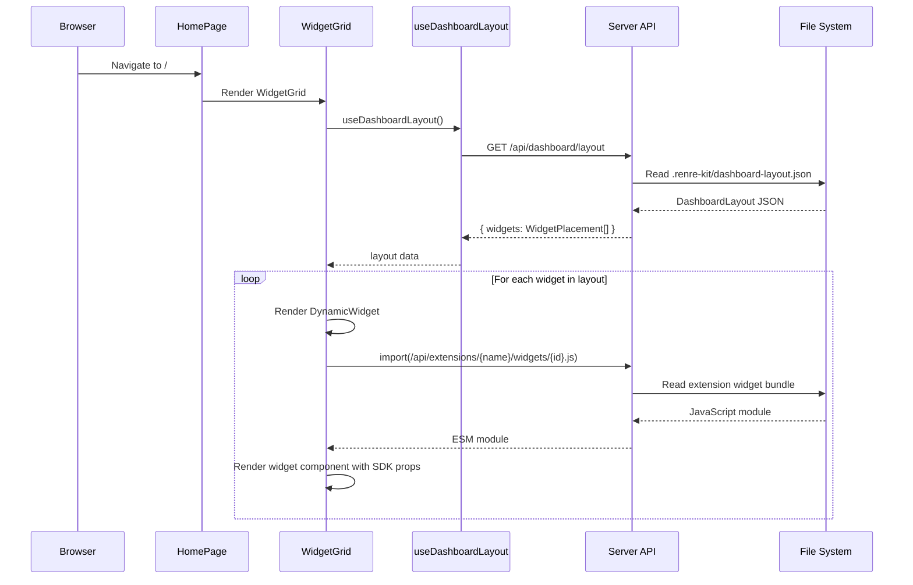
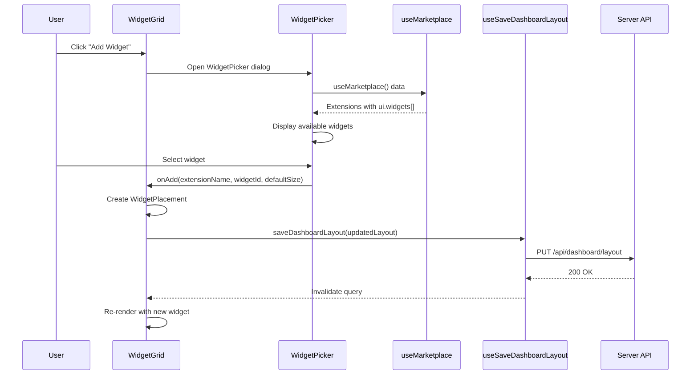
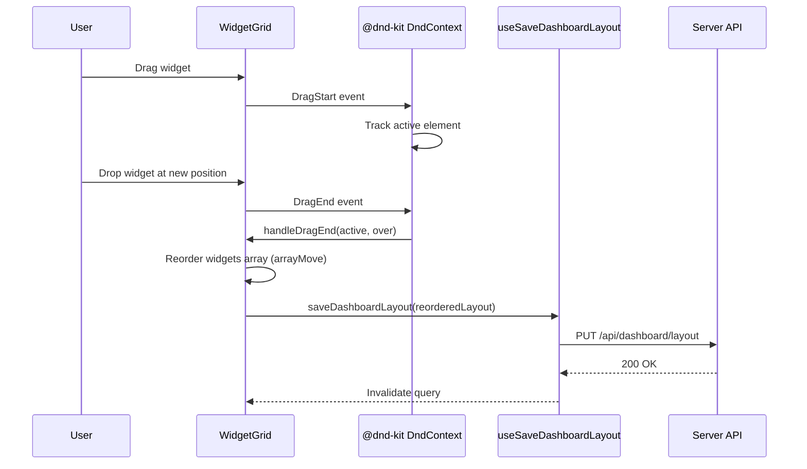

# Widget Dashboard - Sequence Diagrams

## 1. Dashboard Page Load

```mermaid
sequenceDiagram
    participant B as Browser
    participant HP as HomePage
    participant WG as WidgetGrid
    participant Hook as useDashboardLayout
    participant API as Server API
    participant FS as File System

    B->>HP: Navigate to /
    HP->>WG: Render WidgetGrid
    WG->>Hook: useDashboardLayout()
    Hook->>API: GET /api/dashboard/layout
    API->>FS: Read .renre-kit/dashboard-layout.json
    FS-->>API: DashboardLayout JSON
    API-->>Hook: { widgets: WidgetPlacement[] }
    Hook-->>WG: layout data

    loop For each widget in layout
        WG->>WG: Render DynamicWidget
        WG->>API: import(/api/extensions/{name}/widgets/{id}.js)
        API->>FS: Read extension widget bundle
        FS-->>API: JavaScript module
        API-->>WG: ESM module
        WG->>WG: Render widget component with SDK props
    end
```

## 2. Add Widget

```mermaid
sequenceDiagram
    participant U as User
    participant WG as WidgetGrid
    participant WP as WidgetPicker
    participant MH as useMarketplace
    participant LH as useSaveDashboardLayout
    participant API as Server API

    U->>WG: Click "Add Widget"
    WG->>WP: Open WidgetPicker dialog
    WP->>MH: useMarketplace() data
    MH-->>WP: Extensions with ui.widgets[]
    WP->>WP: Display available widgets

    U->>WP: Select widget
    WP->>WG: onAdd(extensionName, widgetId, defaultSize)
    WG->>WG: Create WidgetPlacement
    WG->>LH: saveDashboardLayout(updatedLayout)
    LH->>API: PUT /api/dashboard/layout
    API-->>LH: 200 OK
    LH-->>WG: Invalidate query
    WG->>WG: Re-render with new widget
```

## 3. Drag Reorder

```mermaid
sequenceDiagram
    participant U as User
    participant WG as WidgetGrid
    participant DND as @dnd-kit DndContext
    participant LH as useSaveDashboardLayout
    participant API as Server API

    U->>WG: Drag widget
    WG->>DND: DragStart event
    DND->>DND: Track active element

    U->>WG: Drop widget at new position
    WG->>DND: DragEnd event
    DND->>WG: handleDragEnd(active, over)
    WG->>WG: Reorder widgets array (arrayMove)
    WG->>LH: saveDashboardLayout(reorderedLayout)
    LH->>API: PUT /api/dashboard/layout
    API-->>LH: 200 OK
    LH-->>WG: Invalidate query
```
